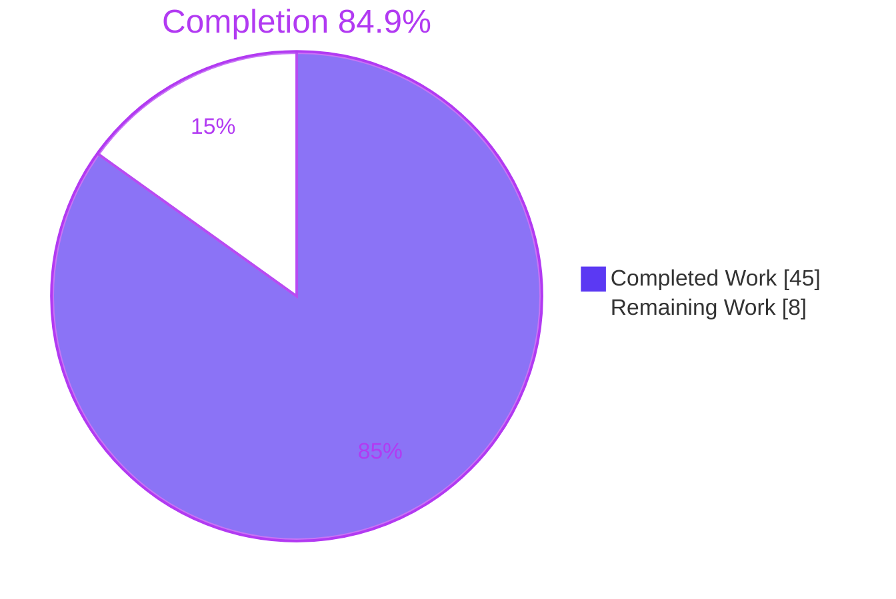
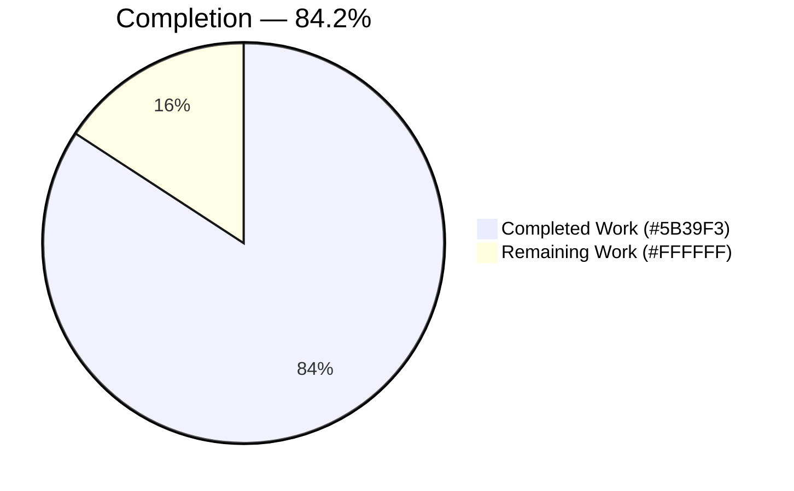
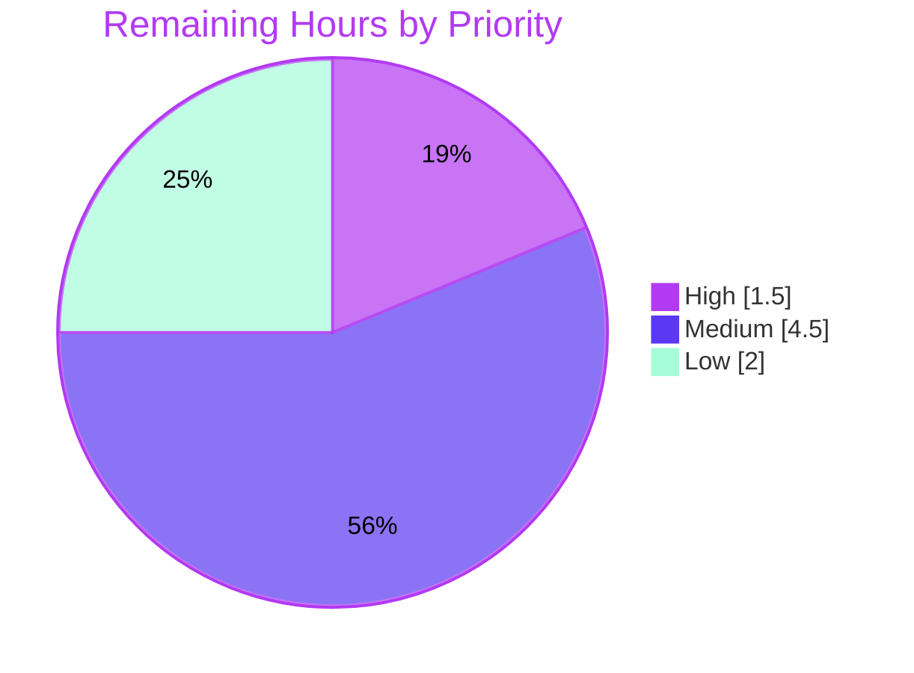
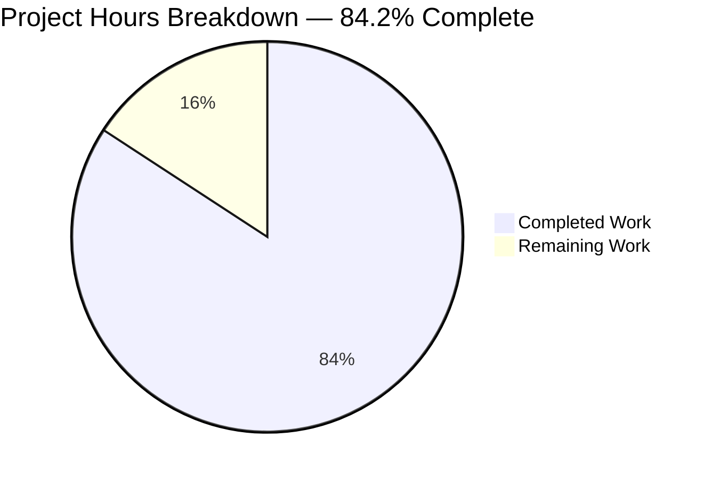
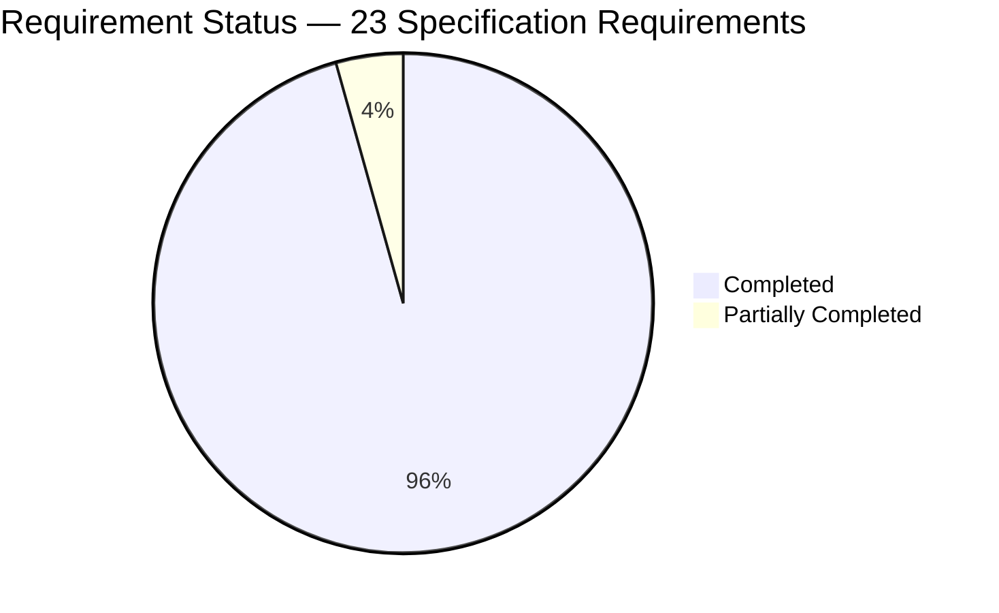

# 1. Executive Summary

## 1.1 Project Overview

This project adds an Express 5 HTTP service to a repository that previously held only a Java console program. `GET /` returns the plain-text body `Hello world`, and `GET /good-evening` returns `Good evening`. Express becomes the first declared dependency, so the change adds an npm manifest, a lock file pinning 68 packages, a Node.js runtime record, an ignore rule, a three-test contract suite, and matching updates to `README.md` and `blitzy/documentation/Project Guide.md`. `Hello.java` is unchanged. The scope is local tutorial use; deployment and CI are excluded.

## 1.2 Completion Status



| Metric | Value |
|---|---|
| Total Hours | 53.0 |
| Completed Hours (AI + Manual) | 45.0 (45.0 AI + 0.0 manual) |
| Remaining Hours | 8.0 |
| Percent Complete | **84.9%** |

45.0 ÷ (45.0 + 8.0) × 100 = **84.9% complete**. All AAP deliverables are done; the 8.0 remaining hours are review, test-hardening and path-to-production work.

**Documentation change effort record — as recorded at `2a78292`.** The chart and table below are the effort record of the earlier documentation change, kept as history with their figures unchanged. They are a separate record and are not summed with the Express service figures above.



**84.2% complete** — 32.0 of 38.0 hours. The chart sets no colours of its own, so the viewer's Mermaid theme supplies them — pale lavender `#ECECFF` for Completed and pale yellow `#ffffde` for Remaining under the default theme — and the `#5B39F3` and `#FFFFFF` in its labels are label text only. Section 2.4 itemises both.

| Metric | Value |
|---|---|
| Total Hours | 38.0 |
| Completed Hours (AI + Manual) | 32.0 |
| Remaining Hours | 6.0 |
| Percent Complete | 84.2% |

These figures describe the documentation change as of `2a78292`, as do the line citations in Sections 2.4 and 5.3; the Express service change dated 2026-09-28 is recorded separately and is not folded into them.

## 1.3 Key Accomplishments

- ✅ Express 5.2.1 pinned; `npm ci` installs 68 packages with 0 known vulnerabilities.
- ✅ `GET /` returns exactly `Hello world` (11 bytes, `text/plain; charset=utf-8`).
- ✅ `GET /good-evening` returns exactly `Good evening` (12 bytes); other paths get Express's 404.
- ✅ `npm start` honours `PORT` and exits 1 with one stderr line on an occupied or invalid port.
- ✅ The contract suite passes 3 of 3 on Node.js 24.21.0 and 20.20.2.
- ✅ `Hello.java` is unchanged; `java Hello.java` still prints `Hello from Java!`.
- ✅ Both documents describe the 11-file tree, and every command in `README.md`, Section 9 and Appendix A runs as written.
- ✅ The tree stays clean after install, run and test.

## 1.4 Critical Unresolved Issues

No release-blocking issue is open: **0 of the 2 requested items** (R1 Express, R2 `Good evening` endpoint) remain open. **7 caveated items** need sign-off (see Section 5.2):

| Issue | Impact | Owner | ETA |
|---|---|---|---|
| 2 behaviours delivered beyond the AAP without committed tests: `PORT` validation and exact routing (`server.js`) | Correct at runtime but unguarded against regression; `server.js` lines 27–43 and 66–92 are uncovered | Reviewer / developer | 4.5 h |
| 1 runtime never exercised: the declared floor, Node.js 20.0.0 | Floor verified on 20.20.2 only, and Node.js 20 is end-of-life | Developer | 1.5 h |
| 1 operational caveat: SIGTERM to npm's pid alone leaves `node server.js` serving | Port stays bound until the node process is signalled | Operator | None — stop with Ctrl-C or the process group |
| 1 network-posture item: the service binds all interfaces and sends default Express headers | Exposure only if the host's network is reachable | Owner | 1.5 h, before any non-local deployment |
| 2 owner decisions deferred by the AAP: per-file GPL notices (F-006-RQ-005) and a `Hello.class` ignore rule (E-3) | Notice gap in three source files; untracked class after an in-place compile | Repository owner | 0.5 h |

## 1.5 Access Issues

No access issues identified. The npm registry needs no credentials, and nothing else external is required.

## 1.6 Recommended Next Steps

1. [High] Review the branch; sign off or revert `PORT` validation and exact routing.
2. [Medium] Add child-process tests for the startup line, rejected `PORT`, bind failure and exact-routing 404s.
3. [Medium] Run the suite on Node.js 20.0.0, or raise `engines.node`.
4. [Low] Before non-local deployment, bind an explicit host and disable `X-Powered-By`.
5. [Low] Supply the GPL notice holder and year; decide the `Hello.class` ignore rule.

# 2. Project Hours Breakdown

## 2.1 Completed Work Detail

| Component | Hours | Description |
|---|---|---|
| npm manifest — `package.json` (R1) | 1.0 | All nine AAP fields: `name`, `version`, `description`, `main`, `scripts.start`, `scripts.test`, `engines.node` `>=20.0.0`, `license` `GPL-3.0-only`, `dependencies.express` `^5.2.1` |
| Lock file — `package-lock.json` (R1) | 1.5 | Generated with npm 11.19.0: `lockfileVersion` 3, 69 entries, `express` 5.2.1 with its published integrity hash; licence census of all 68 packages (63 MIT, 4 ISC, 1 BSD-3-Clause) |
| Express service — `server.js` (R2 and the `Hello world` endpoint) | 6.0 | Two plain-text `GET` routes, exact routing, `PORT` resolution with a 3000 default, a guarded `app.listen`, the Express 5 listen-callback failure branch, the `{ app }` export, and inline design comments (95 lines) |
| Contract suite — `test/server.test.js` | 6.0 | Three tests on Node's built-in runner; a per-test `withServer` helper that binds port 0 and tears down deterministically on pass, failure or server error, compatible with the Node.js 20 floor (145 lines) |
| Runtime record and hygiene — `.nvmrc`, `engines.node`, `.gitignore` | 1.5 | Node.js 24.21.0 recorded for nvm, a `>=20.0.0` floor, and the single rule `node_modules/`; checked on 24.21.0 and 20.20.2 |
| `README.md` update | 5.0 | All eight sections kept in order; change summary within its 70-word, 8-line budget; prerequisites, run commands, output contract, 11-file layout and licence note; ASCII, LF-only, no line-number citations |
| `blitzy/documentation/Project Guide.md` update | 10.0 | Every present-tense claim the change falsifies corrected across 19 locations; historical Java results dated as of `2a78292`; §9 operator reference and Appendices B–F rewritten for the service; LF-only UTF-8 preserved |
| Java preservation and coexistence checks | 2.0 | `Hello.java`, `LICENSE` and `Technical Specifications.md` unchanged; strict compile, source and compiled launches, and simultaneous operation with the service |
| Service verification | 12.0 | HTTP contract, lifecycle and signals, `PORT` and console output, install reproducibility and drift refusal, load and memory, security probes, browser rendering, and replay of every command in both documents |
| **Total** | **45.0** | Matches Completed Hours in Section 1.2 |

## 2.2 Remaining Work Detail

| Category | Hours | Priority |
|---|---|---|
| Review the branch; sign off or revert the two decisions beyond the AAP — `PORT` validation and exact routing (Section 5.2, D1–D2) | 1.5 | High |
| Commit tests for delivered but untested behaviour: `resolvePort`, the rejected-`PORT` and bind-failure exits, the startup line, exact-routing 404 variants | 3.0 | Medium |
| Exercise the declared floor and reference runtimes exactly (Node.js 20.0.0; OpenJDK 25.0.4.1), or raise `engines.node` off end-of-life Node.js 20 (D3) | 1.5 | Medium |
| Pre-exposure hardening before any non-local deployment: explicit bind host, `X-Powered-By` disabled, `nosniff` on 200 responses | 1.5 | Low |
| Owner decisions deferred by the AAP: rights holder and year for per-file GPL notices (F-006-RQ-005); `Hello.class` ignore rule (E-3) (D6) | 0.5 | Low |
| **Total** | **8.0** | Matches Remaining Hours in Sections 1.2 and 7 |

## 2.3 Hours Reconciliation

| Check | Value |
|---|---|
| Section 2.1 completed | 45.0 h |
| Section 2.2 remaining | 8.0 h |
| Total (2.1 + 2.2) | 53.0 h = Total Hours in Section 1.2 |
| Completion | 45.0 ÷ 53.0 × 100 = 84.9% |

Confidence is high for the manifest, lock, runtime record, Java checks, review and owner-decision rows, and medium for code, documentation and verification effort. The pre-exposure hardening estimate is low-confidence because it depends on the target environment. A CI executor is excluded from the hours: the AAP (§0.8.2) places CI workflows out of scope, so it appears only as a risk (Section 6).

## 2.4 Documentation Change Effort Record — as of `2a78292`

The tables below are the effort record of the earlier documentation change, as recorded at `2a78292` and kept as history with their figures unchanged. They are a separate record: their hours are not summed with the Express service figures in Sections 2.1 to 2.3.

**Completed work, as of `2a78292`**

| Component | Hours | Description |
|---|---|---|
| `Hello.java` in-source documentation | 4.0 | Enumerating the four written functionalities of the compilation unit and authoring one comment each — class Javadoc at column 0, entry-point Javadoc at four-space indent with `@param args`, and two eight-space line comments — to Oracle's doc-comment conventions, with every added line re-emitted with CRLF so the stored format survives (`Hello.java:1-18`) |
| `README.md` project guide | 8.0 | Replacing the placeholder line with 77 lines of operator guidance across eight sections: overview, prerequisites with the source-launch version floor, build with the artifact warning, both launch paths with the argument-contract table, expected output expressed portably, project layout and licence pointer (`README.md:10-77`) |
| Italic change highlighting and summary block | 2.5 | Placing the change summary as the guide's first content block, holding it to 55 words across 3 source lines, wrapping one entry per changed file wholly in emphasis with the file name in a code span, adding the dated modification notice required for a modified GPLv3 work, and keeping emphasis out of every other section (`README.md:3-8`) |
| Behaviour and byte-format preservation | 3.5 | Proving the edit changed nothing executable: compile parity, stdout/stderr/exit comparison against a build of the pre-comment source, debug-free bytecode equality, argument-variant runs, and the line-ending, encoding and tab censuses on both changed files |
| Comment-coverage measurement | 1.5 | Measuring documentable-member coverage with `javadoc` and `-Xdoclint:all` before and after, confirming the fall from three warnings to one, zero doclint errors, correct tag usage, and that the generated HTML carries both comment blocks |
| Acceptance-check execution and discrimination controls | 4.5 | Running the nine-group check suite end to end, plus negative and tamper controls that prove each assertion discriminates — normalised line endings, an edited output literal, a removed comment, a detached Javadoc block, a renamed section, a wrong date, emphasis moved into a code span, an added link, an injected line locator |
| Guide-to-toolchain seam validation | 2.5 | Executing every command the guide documents in scratch copies of the repository, comparing the guide's expected-output block byte-for-byte against real stdout, and proving the untracked-artifact claim by compiling inside a throwaway clone |
| Scope and continuity discipline | 1.5 | Confirming `LICENSE` byte-identical at base, commit and working tree; a 21-name sweep for build, CI, ignore and documentation-generator files; no build artifact in the checkout; commit authorship and a clean working tree |
| Documentation and code quality review | 4.0 | Claim-by-claim verification of the guide against the source it describes, citation/link/emphasis censuses, comment prose read line-by-line against the code, and a safety review of every documented command |
| **Total** | **32.0** | Matches Completed Hours in the Section 1.2 record as of `2a78292` |

**Remaining work, as of `2a78292`**

| Category | Hours | Priority |
|---|---|---|
| Verification baseline — supply the pre-comment revision to the comment-census check and record the invocation | 1.0 | High |
| Branch publication and merge, as recorded at `2a78292` for the documentation change — push, review the two-file diff, merge | 0.5 | High |
| Citation-coverage decision — keep two stable-symbol references or extend to every body section (amend the budget and its check first) | 1.0 | Medium |
| `JDK 11 or later` confirmation on a JDK 11 runtime, or softening the claim | 1.0 | Medium |
| Rendered-guide review on the hosting platform — emphasis, tables, fenced blocks, relative links | 0.5 | Medium |
| Deferred repository-hygiene decisions — per-file licence notice, ignore rule for build output (`node_modules/` now covered, class output still open), line-ending policy, Java version pin (Node now recorded by `.nvmrc` and `engines.node`) | 2.0 | Low |
| **Total** | **6.0** | — |

The Express service change dated 2026-09-28 has its own release action — push, review the branch, merge (Section 1.6, step 1). It is estimated separately in Sections 2.1 to 2.3 and is not part of the 6.0 hours above.

**Hours reconciliation, as of `2a78292`**

| Quantity | Hours | Source |
|---|---|---|
| Completed | 32.0 | Section 2.4 completed-work total |
| Remaining | 6.0 | Section 2.4 remaining-work total |
| Total Project Hours | 38.0 | 32.0 + 6.0, as stated in the Section 1.2 record as of `2a78292` |
| Percent Complete | 84.2% | 32.0 / 38.0 × 100 |

Confidence is **high** on the completed figures: the deliverable is two files and 92 added lines, every one of which was read, and each verification claim rests on a command that was executed. Confidence is **medium** on the remaining figures, because four of the six items are decisions whose scope the owner sets rather than fixed units of work — the hour values assume each decision is taken and implemented once, with no change of direction.

# 3. Test Results

The results in the table below were executed at HEAD `646f6fe` on 2026-09-28 and observed directly; the Not Covered list that follows it cites the current `server.js`, and the `2a78292` record further below carries its own date.

| Area / Category | Framework | Tests | Passed | Failed | Coverage | What This Proves |
|---|---|---|---|---|---|---|
| HTTP contract suite — Node.js 24.21.0 | Node built-in test runner (`npm test`) | 3 | 3 | 0 | `server.js`: 64.94% lines, 75.00% branches, 50.00% functions | Both bodies, the media type and the 404 for an unregistered path match the contract exactly |
| HTTP contract suite — Node.js 20.20.2 | Node built-in test runner | 3 | 3 | 0 | — | The suite runs unchanged on the Node.js 20 line the `engines` floor names |
| Service runtime probe (non-default port) | `curl`, `node` | 14 | 14 | 0 | n/a | Startup line, both endpoints, exact-routing 404s, `PORT` validation, bind failure, both stop paths and the `{ app }` export behave as documented |
| Install reproducibility | `npm ci`, `npm ls` | 5 | 5 | 0 | 68 packages | The lock installs 68 packages online and offline, `express` resolves to 5.2.1, and a mismatched manifest is refused |
| Dependency security | `npm audit` | 1 | 1 | 0 | 68 packages | No known advisory affects the installed tree as of 2026-09-28 |
| Java program preservation | `javac -Xlint:all -Werror`, `java` | 3 | 3 | 0 | n/a | The strict compile is clean, and both launch forms print the 17-byte `Hello from Java!` greeting |
| Static checks and hygiene | `node --check`, `git status` | 3 | 3 | 0 | n/a | Both JavaScript files parse, and the tree is clean after install, run and test |
| Runtime record | nvm | 1 | 1 | 0 | n/a | `.nvmrc` selects Node.js 24.21.0 with npm 11.19.0 |

**Not Covered** — delivered, but not exercised by any committed test:

- **`resolvePort` and the rejected-`PORT` exit** (`resolvePort` at `server.js` lines 27–43; the rejection call at line 88, which reaches the shared failure branch at lines 73–80): verified only by runtime probes. Test valid, leading-zero, empty and invalid values before release.
- **The launch block** (`server.js` lines 65–92): the startup line, the EADDRINUSE message and exit code 1 have no committed test. Add a child-process test.
- **Exact routing** (`server.js` lines 18–19): removing either setting would not fail the suite. Add `/GOOD-EVENING` and `/good-evening/` 404 assertions.
- **`withServer` error branches** (`test/server.test.js`): the setup-failure, mid-test server-error and close-failure paths are not triggered by any committed test.
- **The declared floor, Node.js 20.0.0**: never executed; 20.20.2 was used. Run the suite on 20.0.0 or raise the floor.
- **The historical V1–V9 Java acceptance procedure**: kept outside the repository by design and not re-run; the Java contract is covered by the preservation checks above.

**Documentation change validation record — as recorded at `2a78292`.** The paragraph, table and list below are the earlier validation record of the documentation change, kept as history with its results unchanged. It is a separate record: its 49 checks are not counted in, or summed with, the Express service results above.

As of `2a78292` the repository carried no committed test suite, and adding one was outside the documentation change's scope, so there was no unit- or integration-test coverage figure to report for it. What exists instead is a nine-group acceptance check suite (V1–V9) covering compilation, runtime behaviour, comment structure, byte format, comment coverage and every structural property of the guide. All figures in the table below are results as of `2a78292`, observed first-hand on JDK 25.0.3: **49 checks executed, 49 passed, 0 failed** — the 37 assertions of the acceptance suite plus 12 direct toolchain checks.

| Area / Category | Framework | Tests | Passed | Failed | Coverage | What This Proves |
|---|---|---|---|---|---|---|
| Compilation and static diagnostics | JDK `javac` 25.0.3 | 2 | 2 | 0 | 1 of 1 compilation unit | The annotated source compiles with zero diagnostics, including under `-Xlint:all -Werror` |
| Runtime behaviour and parity | Acceptance V2 + JDK launcher | 6 | 6 | 0 | Both documented launch paths | Output, error stream and exit status are byte-identical to a build of the pre-comment source, and arguments never alter the result |
| Comment structure and placement | Acceptance V3 | 7 | 7 | 0 | 4 of 4 functionalities | The change adds exactly four comments, each attached to the construct it documents, and alters no code line |
| Stored byte format | Acceptance V4 | 7 | 7 | 0 | Both changed files | `Hello.java` keeps CRLF on every line, pure ASCII and no tabs; the guide stays LF-only, UTF-8 and newline-terminated |
| Comment coverage | `javadoc` 25.0.3 + Acceptance V5 | 2 | 2 | 0 | 2 of 3 documentable members | The class and entry point are documented; only the implicit constructor, which can carry no doc comment, is not |
| Guide structure, summary and highlighting | Acceptance V6–V7 | 8 | 8 | 0 | 8 of 8 sections | The change summary is the guide's first content block, sections run in the required order, and italics mark the two changed files and nothing else |
| Guide links, literals and citations | Acceptance V8–V9 | 10 | 10 | 0 | 2 of 2 links, 2 of 2 citations | Both relative links resolve on disk, every mandated operator literal is present, and sources are cited by stable symbol with no line-number locators |
| Cross-release compilation | JDK `--release` / `--source` | 7 | 7 | 0 | Release targets 11, 17, 21 | The compile-then-run path carries no recent-JDK floor, which is what the guide's Requirements section claims |

**Not Covered — Java program and documentation change**

- **The guide's rendered appearance.** As of `2a78292`, emphasis, the two tables, the four fenced blocks and both relative links were asserted against the Markdown source, never against a rendered page, and the guide as rewritten for the Express service has not been reviewed rendered either. Open the guide once on the hosting platform before release.
- **The `JDK 11 or later` floor on a JDK 11 runtime.** It was corroborated only by compiling at release targets 11, 17 and 21 and by `java --source 11` on a JDK 25 toolchain. Confirm it on a real JDK 11 install, or soften the claim.
- **The wording of the four comments and of the guide prose.** Comment text is not executed and prose accuracy is not machine-checkable; both were read against the source they describe, but no check asserts them.
- **The comment-census checks under their default baseline.** They compare the working source against the current commit, so they measure the added comments only when handed the pre-comment revision; with the default baseline the suite's own tally on a correct tree is 33 of 37.

# 4. Runtime Validation & UI Verification

The service has no user interface; its human-facing surface is two plain-text bodies, verified with `curl` and in headless Chrome.

- ✅ **Start-up** — `npm start` prints `Hello service listening on http://localhost:<PORT>` and stays resident; launch to first 200 takes 73–145 ms.
- ✅ **`GET /`** — 200, `text/plain; charset=utf-8`, exactly 11 bytes `Hello world`; Chrome renders it as plain text with no console errors.
- ✅ **`GET /good-evening`** — 200, same media type, exactly 12 bytes `Good evening`; identical in Chrome.
- ✅ **Unregistered paths** — `GET /nope` returns Express's 143-byte HTML 404 with `Content-Security-Policy: default-src 'none'` and `nosniff`; other unmatched paths, including `/GOOD-EVENING` and `/good-evening/`, also return that HTML 404 with the same headers, but its body embeds the requested path, so its length varies (151 and 152 bytes respectively).
- ✅ **Configuration** — `PORT` overrides 3000 and leading zeros are dropped; invalid values and an occupied port each exit 1 with one stderr line; nothing else is logged per request.
- ✅ **Load and resilience** — 0 errors across more than 31 million checked responses; p95 3.4–3.9 ms at 50 concurrent requests; memory plateaus and descriptors return to baseline.
- ✅ **Security probes** — XSS through the 404 page, path traversal, request smuggling, CRLF injection and CORS probes produced no exploit, and no stack trace or secret surfaced.
- ⚠ **Shutdown** — Ctrl-C, a process-group signal or SIGTERM to the node pid frees the port; SIGTERM to npm's pid alone leaves `node server.js` serving, and in-flight requests are cut rather than drained.
- ✅ **Java coexistence** — `java Hello.java` prints its greeting while the service runs, and no endpoint ever serves the Java greeting.
- ✅ **Integrations** — none at runtime and no authentication by design; the npm registry is reached only at install time.

**Never exercised at runtime:** deployment to any host beyond the local machine, TLS or a reverse proxy, and the Node.js 20.0.0 runtime.

**Java program and documentation change runtime record — as recorded at `2a78292`.** The paragraph and list below are the earlier runtime validation of the Java program for the documentation change, kept as history with its results unchanged. It is a separate record and is not part of the Express service checks above.

The Java program is a console application with no user interface and no hosted page; it binds no port and has no external integration, so its runtime validation means driving the compiler, the launcher, the documentation tool and every command the guide tells an operator to type. All of the following were executed and observed, and form the record as of `2a78292`.

- ✅ **Operational — Compile.** `javac -Xlint:all -Werror` exits 0 with an empty error stream; class output directed outside the checkout, which stays clean.
- ✅ **Operational — Compiled-class launch.** `java -cp <out> Hello` prints `Hello from Java!` followed by one newline (17 bytes on this host), with an empty error stream and exit status 0.
- ✅ **Operational — Direct source launch.** `java Hello.java` prints the same payload and leaves no class file behind.
- ✅ **Operational — Behaviour parity.** Both streams and the exit status compare byte-identical against a build of the pre-comment source; suppressing debug information makes the two class files identical.
- ✅ **Operational — Argument contract.** Runs with no arguments, many arguments, and hostile arguments including shell and injection payloads all produce identical output; the parameter is never dereferenced.
- ✅ **Operational — Documentation tool.** `javadoc -quiet` exits 0 with exactly one warning, for the implicit default constructor, and the generated HTML carries both comment blocks and the parameter table.
- ✅ **Operational — Guide's build guidance.** The guide's alternate destination, a freshly generated owner-only directory, compiles and launches clean end to end.
- ✅ **Operational — Guide's expected output.** The fenced expected-output block compares byte-identical to real standard output.
- ✅ **Operational — Untracked-artifact claim.** Compiling inside a throwaway clone leaves the class file untracked and unignored, exactly as the Build section states.
- ⚠ **Partial — Version-floor claim.** The compile-then-run path was exercised at release targets 11, 17 and 21, but the `JDK 11 or later` floor for the direct source launch has not been run on a JDK 11 runtime; only JDK 25 was available.

# 5. Compliance & Quality Review

## 5.1 Compliance Matrix

| # | AAP Deliverable | Benchmark | Status | Progress | Evidence |
|---|---|---|---|---|---|
| 1 | npm manifest | All nine §0.4.2 fields; licence matches `LICENSE` | ✅ Pass | 100% | `package.json` |
| 2 | Lock file | Generated, not hand-written; 5.2.1 with integrity hash; `npm ci` reproducible, drift refused | ✅ Pass | 100% | `package-lock.json` |
| 3 | `GET /` → `Hello world` | 200, `text/plain; charset=utf-8`, exact 11 bytes | ✅ Pass | 100% | `server.js` route 1; suite test 1 |
| 4 | `GET /good-evening` → `Good evening` | 200, same type, exact 12 bytes | ✅ Pass | 100% | `server.js` route 2; suite test 2 |
| 5 | Listener and lifecycle | `require.main` guard, `{ app }` export, startup line, one failure branch, two console calls | ✅ Pass (⚠ launch block untested) | 100% | `server.js` lines 65–95 |
| 6 | Runtime record | `engines.node` `>=20.0.0`; `.nvmrc` `24.21.0` | ✅ Pass (⚠ floor run on 20.20.2) | 100% | `package.json`, `.nvmrc` |
| 7 | Ignore rule | `node_modules/` only; tree clean after install and run | ✅ Pass | 100% | `.gitignore` |
| 8 | Contract suite | Three tests on built-ins, no added dependency, bare `node --test` | ✅ Pass | 100% | `test/server.test.js` |
| 9 | `README.md` | Eight sections in order; summary budget; ASCII, LF; runnable commands; 11-file layout | ✅ Pass | 100% | `README.md` |
| 10 | Development record | No stale absence claim; history dated as of `2a78292`; LF-only UTF-8 | ✅ Pass | 100% | `blitzy/documentation/Project Guide.md` |
| 11 | Java preservation | Zero edits; strict compile clean; 17-byte output | ✅ Pass | 100% | `Hello.java`, `LICENSE` |
| 12 | Code quality | No TODO, FIXME, stubs or hardcoded secrets; only `express` added; all licences GPLv3-compatible | ✅ Pass | 100% | Tracked tree at `646f6fe` |

## 5.2 AAP & Rule Divergences and Gaps

No user-specified rules were provided, so divergences are measured against the AAP.

| # | What the AAP/Rule Required | What Was Delivered Instead | Why It Diverged | Impact | Remediation |
|---|---|---|---|---|---|
| D1 | `PORT` read as `process.env.PORT \|\| 3000` (§0.5.1) | `resolvePort` selects 3000 for unset or empty `PORT` and accepts a non-empty override only as decimal digits for 1–65535 (leading zeros dropped); any other non-empty value is rejected before binding with exit 1 (`server.js` lines 27–43, 65–92) | `app.listen` mishandles non-numeric, `0` and out-of-range values | Safer, but untested; message says "bind" when none was attempted; `server.js` is 95 lines against a planned ~25 | Sign off and add tests, or revert |
| D2 | Two named routes; variants unspecified (§0.5.1, §0.8.2) | Case-sensitive and strict routing (`server.js` lines 18–19) | Keep variants from answering as a third endpoint | `/good-evening/` returns 404; no committed test guards it | Sign off and add tests, or remove |
| D3 | Floor on Node.js 20.0.0; Java on OpenJDK 25.0.4.1; service on port 3000 (§0.4.1, §0.6.1) | Node.js 20.20.2, OpenJDK 25.0.3; port 3000 only in isolated network namespaces | Host prohibits older 20.x installs; 25.0.4.1 unavailable; port 3000 shared | Floor claim unproven on 20.0.0; Node.js 20 is end-of-life | Run on 20.0.0, or raise the floor |
| D4 | Manifest written without dependencies, then `npm install express@5.2.1` (§0.7.2) | Manifest committed complete in `e45e558`; lock generated in `87a8aaf` | Not recorded | None: lock pins 5.2.1 with the AAP's integrity hash | None required |
| D5 | Stop with Ctrl-C or by killing the pid captured at launch (§0.6.1) | SIGTERM to npm's pid alone leaves `node server.js` serving | Consequence of the AAP-specified `scripts.start` and default signal handling | Port stays bound if only npm is signalled | None in code; use a documented stop path |
| D6 | AAP-sanctioned: per-file GPL notice (F-006-RQ-005) and `Hello.class` ignore rule (E-3) left open (§0.4.3, §0.7.2) | Neither added | No rights holder or year recorded; E-3 is an owner decision | Notice gap in three source files; untracked class after in-place compile | Owner supplies holder and year; decides the ignore rule |

**D1 — `PORT` validation.** The AAP reads the port as `process.env.PORT || 3000`. `server.js` resolves it through `resolvePort` (lines 27–43) instead: unset or empty `PORT` selects 3000, and a non-empty override must be decimal digits only, for a value from 1 to 65535, with leading zeros dropped. Any other non-empty value is rejected before binding and exits 1 with `Failed to bind port: PORT must be a decimal integer from 1 to 65535` (lines 65–92, commit `a33214b`). The comments at lines 32–34 and 40–41 record why: `app.listen` treats a non-numeric value as an IPC socket path, binds an OS-chosen port the startup line cannot name for `0`, and throws above 65535. The behaviour is sound but has no committed test, and its message says "bind" although nothing was bound. The reviewer should accept it and add tests, or revert it.

**D2 — Exact routing.** The AAP names two paths but says nothing about letter case or trailing slashes, while §0.8.2 states that only `GET /` and `GET /good-evening` exist. Express's defaults would answer `/GOOD-EVENING` and `/good-evening/` with a greeting. `server.js` therefore enables `case sensitive routing` and `strict routing` before registering routes (lines 18–19, commit `0ece6c6`), so every variant falls through to the built-in 404, as `README.md` §Expected Output states. The trade-off is that a browser URL typed with a trailing slash returns 404, and no committed test guards either setting. The owner should decide whether the stricter contract stays, and if so add variant assertions to `test/server.test.js`.

**D3 — Verification runtimes.** The AAP exercises the floor on Node.js 20.0.0, runs the Java checks on OpenJDK 25.0.4.1 and starts the service on port 3000. On the verification host, installing any Node.js 20.x below 20.20.2 is prohibited, 25.0.3 is the only available OpenJDK 25 build, and port 3000 is shared. So the suite and service ran on 20.20.2, the Java checks on 25.0.3, and literal-3000 commands only inside isolated network namespaces. npm's engine check accepts 20.0.0, but the root-hook behaviour that shaped the test helper was never reproduced. Node.js 20 reached end-of-life on 2026-03-24, so run the suite on 20.0.0 in an isolated environment, or raise the floor.

**D4 — Lock generation order.** The AAP prescribes writing the manifest without a `dependencies` block and then running `npm install express@5.2.1`, so one command writes both the caret range and the pinned lock. Instead, `package.json` was committed complete, `express` `^5.2.1` included, in `e45e558`, and the lock was generated against it in `87a8aaf`; the reason for that ordering is not recorded. The AAP's concern, a resolution to some newer 5.x release, did not arise: the lock pins 5.2.1 with exactly the integrity hash the AAP records, and `npm ci` reproduces all 68 packages. No action is needed; regenerate the lock only with `npm install express@5.2.1`.

**D5 — Stop-path caveat.** The AAP's acceptance sequence says to stop the service with Ctrl-C or by killing the pid captured at launch. The AAP also sets `scripts.start` to `node server.js` and leaves shutdown to Node's defaults (§0.4.2, §0.5.2), so `npm start` runs as npm → `sh` → `node`. SIGTERM sent to npm's pid alone ends npm and leaves `node server.js` holding the port. Ctrl-C, a process-group signal and SIGTERM to the node pid all stop it cleanly, and `blitzy/documentation/Project Guide.md` §9.5 documents the caveat. No code change fits within the AAP; operators and scripts must use one of the documented stop paths.

**D6 — Owner decisions left open (AAP-sanctioned).** Two items stay open by the AAP's own decision. F-006-RQ-005 asks for the GPL's per-file copyright and warranty notice, which needs a named rights holder and year that no tracked file records. `server.js` and `test/server.test.js` therefore ship without one, as `Hello.java` already did, widening the gap from one source file to three. E-3 concerns the `Hello.class` that an in-place `javac Hello.java` leaves behind: `.gitignore` covers only `node_modules/`, and `README.md` §Build documents the `mktemp -d` alternative. Neither item affects behaviour. The owner must supply the holder and year, and decide whether class output should be ignored.

## 5.3 Documentation Change Review — as of `2a78292`

This subsection reviews the documentation change as of `2a78292`; its `README.md:N` citations refer to the guide at that commit. It is kept as history with its verdicts unchanged, as a separate record from the Express service review in Sections 5.1 and 5.2, and its divergences 1–5 are distinct from D1–D6 there.

**Compliance matrix, as of `2a78292`**

| # | Deliverable / Benchmark | Status | Progress | Evidence |
|---|---|---|---|---|
| 1 | One explanatory comment per written functionality | ✅ Pass | 4 of 4 | `Hello.java:1-5`, `:7-14`, `:16`, `:18` — class, entry point, output statement, termination path |
| 2 | Comment form and placement follow the language's conventions | ✅ Pass | 2 Javadoc + 2 line comments | Class block opens at column 0, member block at four spaces with a `@param args` tag and no `@return`; both line comments at eight spaces |
| 3 | Comment-only edit — no behaviour, signature or formatting change | ✅ Pass | 15 added / 0 removed | The five original code lines are byte-identical to the pre-comment revision; debug-free bytecode identical |
| 4 | Stored formatting preserved per file | ✅ Pass | 20 of 20 lines CRLF | `Hello.java` CRLF throughout, pure ASCII, zero tabs; `README.md` LF-only with a trailing newline |
| 5 | Change summary is the guide's first content block | ✅ Pass | 1 title + summary | `README.md:1` is the title, `:3` the summary heading |
| 6 | Summary held to a small budget | ✅ Pass | 55 / 70 words, 3 / 8 lines | `README.md:5-8` |
| 7 | Every change highlighted in italics, one entry per changed file | ✅ Pass | 2 of 2 changes | `README.md:7-8`; emphasis appears nowhere else in the guide |
| 8 | Dated modification notice for a modified GPLv3 work | ✅ Pass | 1 notice | `README.md:5` |
| 9 | Guide sections present and in the required order | ✅ Pass | 8 of 8 | Headings at `README.md:3,10,16,22,32,55,65,75` |
| 10 | Operator guidance: build, run, expected output, version floor, artifact warning | ✅ Pass | 5 of 5 literals | `README.md:22-63`, every command executed as written |
| 11 | Source cited by stable symbol, never by line number | ⚠ Partial | 2 of 2 required references, 2 of 7 body sections | `README.md:14,53`; zero line-number locators. See divergence 1 |
| 12 | Documentable-member coverage | ⚠ Partial | 2 of 3 members | `javadoc` reports one remaining warning, for the implicit default constructor. See divergence 4 |

Rule compliance: the user rule requiring clean code with a comment on each functionality written is satisfied — four functionalities, four comments, and cleanliness achieved by commenting rather than restructuring, with an additions-only diff proving no member was renamed, reordered or reformatted. The second user rule declares itself to be for testing only and states no technical constraint; nothing in the delivered work was derived from it and no requirement was invented on its behalf. The Express service change of 2026-09-28 operated under no user rules.

**Divergences and gaps, as of `2a78292`**

| # | What the AAP/Rule Required | What Was Delivered Instead | Why It Diverged | Impact | Remediation |
|---|---|---|---|---|---|
| 1 | "Every guide section references the source it documents by stable symbol" | Two references only, in Overview and Run; five body sections carry none | The plan also fixes the reference budget at exactly two and asserts that count mechanically; the two instructions conflict | None on correctness — every documented fact still traces to an authority | Owner decision: extend coverage only after amending the budget and its check |
| 2 | Comment-census verification compares the edited source against the current commit | The authoritative run compares against the pre-comment revision instead | The comment work is committed, so at the current commit the comparison is empty and the census degenerates to zero | A correct tree scores 33 of 37 checks when the baseline is not supplied | Pass the pre-comment revision as the baseline argument |
| 3 | Build section = the fenced compile command plus the untracked-artifact note | Also documents an alternate output directory and the matching launch command | Safe-command guidance permitted retaining an external destination if freshly generated, quoted and used consistently | None adverse; the primary commands are unchanged and both alternates run clean | Optional: delete the third sentence of `README.md:30` for the minimal form |
| 4 | Close the comment-coverage gap by documenting all three documentable members | Two of three documented; one `javadoc` warning remains | A default constructor can carry no doc comment, and declaring one is a structural change the comment-only constraint forbids | Coverage 2 of 3; no functional impact | None, unless the owner accepts an explicit constructor |
| 5 | Repository-hygiene items placed out of scope: per-file licence notice, version pin, line-ending policy, ignore rule, automated gate | None added; mixed CRLF/LF retained; the untracked class file documented rather than ignored. Subsequently, the Express change added `package.json`, `package-lock.json`, `.gitignore` (`node_modules/` only), `.nvmrc` and `test/server.test.js`; the class-output ignore rule, Java version pin, line-ending policy, CI workflow and per-file notice remain deferred | Sanctioned exclusions — the notice needs a copyright holder the repository does not record, and normalising line endings would change the source file's content digest | In-tree compiles leave untracked output; Java builds are unpinned; no CI gate re-runs the checks | Owner decisions, each independent of the delivered documentation |

**1 — Citation coverage.** The plan carries two instructions that cannot both hold: a general one requiring every guide section to cite its source by stable symbol, and an enumerated one fixing the guide at exactly two references. The enumerated count is the specific contract and is asserted mechanically, so it governs. The guide cites `Source: Hello.java (class Hello)` at `README.md:14` and `Source: Hello.java (Hello.main)` at `README.md:53`; Requirements, Build, Expected Output, Project Layout and Licence carry none. Nothing is unattributed — the Overview reference covers the class and default-package facts, the Run reference the argument, single-line-output and normal-return facts. To extend coverage, amend the two-reference budget and its check first.

**2 — Verification baseline.** The comment-census check proves the edit is additions-only by diffing the working source against a named revision, and the plan names the current commit. That held while the comment work was uncommitted; it no longer does. At the current commit the diff is empty, so the census counts zero comment blocks and the indentation and placement assertions fail vacuously — four failures against a correct tree. Handing the check the pre-comment revision restores the intent, additions-only relative to the pre-edit source, and the suite then passes 37 of 37. The V1–V9 script is provisioned outside the repository and stays outside the checkout, so the remedy is the invocation.

**3 — Build section scope.** The plan specifies the Build section as the fenced compile command plus a note that compiling in place leaves an untracked class file. `README.md:30` goes further: it documents `B="$(mktemp -d)" && javac -d "$B" Hello.java` with the matching `java -cp "$B" Hello`, and one sentence on why a freshly generated owner-only directory beats a fixed, predictable one. Safe-command guidance permitted keeping an external destination provided it is uniquely generated, quoted and used consistently, and a guide that says compile elsewhere without saying how to launch from elsewhere is incomplete. Both commands were executed as written. Deleting that third sentence is all the minimal form needs.

**4 — Documentable-member coverage.** The specification's original closing condition for the comment-coverage gap was three comment blocks, one per member the documentation tool reports. Only two of those members are written in the source. The third is the implicit default constructor the language supplies because the class declares none, and such a constructor can carry no doc comment: the only way to attach one is to declare the constructor, a structural change the comment-only constraint forbids. The plan itself revises the target to two of three and warnings from three to one, which is exactly what `Hello.java` delivers — one warning remains at `Hello.java:6`. Closing it fully is a separate structural decision.

**5 — Deferred hygiene items.** Five adjacent gaps were identified and deliberately not closed. `Hello.java` carries no per-file copyright and warranty notice, which the licence's appendix advises, because that notice needs a named holder and year and no tracked file records either — commit metadata identifies an author, not a rights holder. No Java version is pinned, and the guide says so plainly rather than choosing one this change had no authority to choose. Line endings stay as stored, CRLF in the source and LF in the guide, because normalising them would rewrite all five code lines and change the file's content digest. Neither an ignore rule nor a build, test or CI descriptor was added. Subsequently, on 2026-09-28, the Express service change added `package.json`, `package-lock.json`, `.gitignore` (covering `node_modules/` only), `.nvmrc` and `test/server.test.js`. The class-output ignore rule, the Java version pin, the line-ending policy, a CI workflow and the per-file notice remain deferred.

# 6. Risk Assessment

| Risk | Category | Severity | Probability | Mitigation | Status |
|---|---|---|---|---|---|
| Behaviour delivered without a committed test (`resolvePort`, launch block, exact routing) regresses unnoticed; `server.js` line coverage is 53.68% | Technical | Medium | Medium | Add child-process and variant-route tests (Section 2.2) | Open |
| Declared floor `>=20.0.0` names an end-of-life runtime (Node.js 20, EOL 2026-03-24) that was never run at 20.0.0 | Technical / Integration | Medium | Medium | Run on 20.0.0 or raise the floor; deploy on the Node.js 24.21.0 recorded in `.nvmrc` | Open |
| The service binds all interfaces (`:::<PORT>`) while its startup line says `localhost`, so it is reachable from the host's network | Security | Medium | Medium | Pass an explicit host to `app.listen`, or firewall the port | Accepted (AAP default) |
| Default headers: `X-Powered-By: Express`; no `nosniff`, CSP or `X-Frame-Options` on 200 responses; `NODE_ENV` unset would render a stack trace if a future handler threw | Security | Low | Low | `app.disable('x-powered-by')`, set headers in both handlers, run with `NODE_ENV=production` | Accepted (AAP default) |
| No rate limit or connection cap; a partial request is held about 74 s before a 408 | Security / Operational | Low | Low | Front with a reverse proxy, or lower `server.headersTimeout` and set `maxConnections` | Accepted |
| Stopping via npm's pid orphans `node server.js` on its port; SIGTERM cuts in-flight requests with no drain | Operational | Low | Medium | Stop with Ctrl-C, the process group or the node pid; use a process manager if deployed | Accepted, documented |
| No CI runs the suite, and nothing monitors the service: it logs only its startup line, and Express 5's `app.listen` absorbs a single post-listening server error silently | Operational | Medium | Medium | Add a CI job running the whole gate under a `timeout` wrapper (outside AAP scope) | Open |
| Supply chain: 68 transitive packages; a cold-cache install needs `registry.npmjs.org`; advisories change over time | Integration / Security | Low | Medium | Install only with `npm ci` from the lock; run `npm audit` periodically; mirror the registry for offline sites | Monitored |

# 7. Visual Project Status


Remaining work by priority (8.0 hours, from Section 2.2):



| Priority | Hours | Categories |
|---|---|---|
| High | 1.5 | Branch review and sign-off of D1–D2 |
| Medium | 4.5 | Tests for untested behaviour (3.0); floor and reference runtimes (1.5) |
| Low | 2.0 | Pre-exposure hardening (1.5); owner decisions (0.5) |
| **Total** | **8.0** | Equals Remaining Hours in Sections 1.2 and 2.2 |

**Documentation change status — as recorded at `2a78292`.** The charts and table below show the documentation project's state as recorded at `2a78292`: the 38.0-hour effort record of Sections 1.2 and 2.4, and the 23 specification requirements tracked for that documentation change — a historical count, not a score against the current specification. The Express service change dated 2026-09-28 is not measured by them; it is charted above and assessed in Section 8, and its effort is recorded separately and not summed with this record.

The three charts of this record — its chart in Section 1.2 and the two below — set no colours of their own, so the viewer's Mermaid theme supplies them: under the default theme the first slice (Completed Work, or Completed) is pale lavender `#ECECFF` and the second (Remaining Work, or Partially Completed) pale yellow `#ffffde`; under the dark theme they are near-black `#0b0000` and plum `#4d1037`.





Remaining hours by category, from Section 2.4 (6.0 hours total):

| Category | Hours | Share | Priority |
|---|---|---|---|
| Deferred repository-hygiene decisions | 2.0 | 33% | Low |
| Verification baseline | 1.0 | 17% | High |
| Citation-coverage decision | 1.0 | 17% | Medium |
| `JDK 11 or later` confirmation | 1.0 | 17% | Medium |
| Branch publication and merge | 0.5 | 8% | High |
| Rendered-guide review | 0.5 | 8% | Medium |
| **Total** | **6.0** | **100%** | — |

By priority: High 1.5 hours, Medium 2.5 hours, Low 2.0 hours.

# 8. Summary & Recommendations

The project is **84.9% complete** against the AAP-scoped work: 45.0 of 53.0 hours are delivered, and every AAP deliverable is in place and verified. Express 5.2.1 is declared and pinned, with 68 packages reproducibly installed from the committed lock. `server.js` answers `GET /` with `Hello world` and `GET /good-evening` with `Good evening`, byte-exact, as `text/plain; charset=utf-8`. The runtime record, ignore rule, three-test suite and both documentation files match the 11-file tree, and `Hello.java` is untouched and still prints `Hello from Java!`.

Verification is broad. The suite passes 3 of 3 on Node.js 24.21.0 and 20.20.2. `npm audit` finds 0 vulnerabilities, and the strict Java compile is clean. Runtime probes confirm the contract, the `PORT` rules, the bind-failure exit and both stop paths. Beyond that, the service returned 0 errors across more than 31 million checked responses under load, withstood XSS, traversal, smuggling and injection probes, rendered correctly in a browser, and every command published in `README.md` and the development record at `646f6fe` reproduced its documented output, except the V1–V9 Java suite, which is kept outside the repository and was not re-run.

The remaining 8.0 hours close three gaps: two behaviours beyond the AAP (`PORT` validation and exact routing) need sign-off and committed tests; the declared Node.js 20.0.0 floor, now an end-of-life line, has never been executed; and two owner decisions deferred by the AAP are still open. The one operational caveat, that signalling only npm's pid leaves the service bound, is documented and needs no code change.

The critical path to production is: review and sign off D1–D2 (1.5 h); add the missing tests (3.0 h); settle the floor (1.5 h). If the service will ever be reachable beyond the local machine, bind an explicit host and disable `X-Powered-By` first. A CI job running the whole gate under a timeout is recommended, although the AAP places CI outside this scope.

| Success Metric | Target | Observed |
|---|---|---|
| Endpoint bodies | `Hello world` / `Good evening`, exact | 11 / 12 bytes, exact |
| Suite | 3 passing, 0 failing | 3 / 3 on 24.21.0 and 20.20.2 |
| Install | 68 packages, no drift | 68; drift refused |
| Java contract | Unchanged | 17-byte greeting; strict compile clean |
| Tree hygiene | `git status --short` empty | Empty |

**Production readiness:** ready for the local tutorial use the AAP targets, and ready for merge once the branch review is complete. Complete the tests and the floor decision before calling it release-grade, and apply the hardening items before any network exposure.

**Documentation change assessment — as recorded at `2a78292`.** The five paragraphs that follow are the documentation change's assessment as recorded at `2a78292`, kept as history with its figures unchanged: 84.2% complete, 32.0 of 38.0 hours, 22 of 23 specification requirements completed and 1 partially, and 49 of 49 checks passed. Only the fifth paragraph's closing recommendation has been brought forward, to name the committed Node suite. The Express service change is assessed separately above, and its figures are not summed with these.

What was asked for has been delivered on both counts. `Hello.java` now explains itself: four comments, one per written functionality, covering the class contract, the entry point and its never-read `args` parameter, the single write to standard output, and the fact that the method returns normally with no explicit exit call. `README.md` is now a project guide rather than a placeholder, opening with an italic summary of exactly these two changes and continuing through prerequisites, build, both launch paths, the expected output, the layout and the licence. The project stands at **84.2% complete — 32.0 of 38.0 hours** — with every specification requirement either delivered or, in one case, delivered and awaiting a change to how its verification is invoked.

The evidence behind that is narrow but deep, as it should be for a two-file change. The delivered source compiles with zero diagnostics under `-Xlint:all -Werror`; its standard output, error stream and exit status are byte-identical to a build of the pre-comment source, and its bytecode is identical once debug information is suppressed — so the claim that nothing but comments was added is proven rather than asserted. Every command the guide tells an operator to type was executed as written, including the alternate build destination, and the guide's expected-output block compares byte-for-byte against real standard output. Forty-nine acceptance checks were executed and all forty-nine passed. The stored formatting that makes this repository awkward to edit — CRLF on every source line, LF in the guide — survived intact.

Three gaps are worth the reader's attention, none of them a defect. First, the comment-census verification needs the pre-comment revision handed to it as a baseline; run without one it reports four failures against a tree that is correct, and that is the single most likely thing to mislead the next person. Second, the guide has never been looked at rendered — its structure was proven against the Markdown source, which is not the same as confirming that two italic entries, two tables and four fenced blocks display as intended. Third, the `JDK 11 or later` floor for the direct source launch is documented but was only corroborated by compiling at release targets 11, 17 and 21 on a JDK 25 toolchain.

The critical path to production is short: supply the verification baseline, glance at the rendered guide, then push and merge. That is two hours of work, and nothing in it depends on a decision. The remaining four hours are genuine decisions rather than tasks — whether to extend source citations to every guide section (which requires amending the two-reference budget and its check first), whether to confirm the version floor on a real JDK 11 runtime or soften the claim, and whether to close the five hygiene items the plan deliberately declined: the per-file copyright notice that needs a rights holder the repository does not record, an ignore rule for build output, an explicit line-ending policy, a version pin, and an automated gate.

Production readiness of the documentation change, as assessed at `2a78292`: **ready to merge.** For a documentation change to a program whose behaviour is provably untouched, the risk of releasing is close to zero, and the guide measurably closes the gaps that made this repository opaque. The one recommendation that outlives this change is the CI risk in Section 6 — with no CI gate, and a committed Node suite that nothing runs automatically, the guide's accuracy depends on future editors honouring the stable-symbol citations that let each claim be checked at its origin. Success is measurable and already measured: four of four functionalities commented, eight of eight guide sections present, two of two changes highlighted, three of three observable behaviours documented, and documentable-member coverage at two of three with the third unreachable by design.

# 9. Development Guide

Run every command from the repository root.

## 9.1 System Prerequisites

- **Node.js 24.21.0 with npm 11.19.0** — the target runtime, recorded in `.nvmrc`. The declared floor is `>=20.0.0` (`engines.node`).
- **A JDK** — any JDK compiles `Hello.java`; the source launch `java Hello.java` needs JDK 11 or later. Verified on OpenJDK 25.0.3.
- **git** and **curl**, on Linux or macOS with a POSIX shell.
- **Network access to `registry.npmjs.org`** for the first install on a machine with a cold npm cache. No credentials are needed.
- About 10 MB of disk for `node_modules/`.

## 9.2 Environment Setup

Optionally select the recorded Node.js version with nvm. nvm is a shell function, so load it first:

```bash
export NVM_DIR="${NVM_DIR:-$HOME/.nvm}"
[ -s "$NVM_DIR/nvm.sh" ] && . "$NVM_DIR/nvm.sh"
nvm install && nvm use
node -v && npm -v
```

Expected: `Now using node v24.21.0 (npm v11.19.0)`, then `v24.21.0` and `11.19.0`. For a system-wide nvm, set `NVM_DIR` to its directory before running the block.

The only variable the code reads is `PORT` (optional, default 3000). No `.env` file or secret is used; see Appendix E.

## 9.3 Dependency Installation

```bash
npm ci
npm ls express
ls node_modules | wc -l
```

Expected: `added 68 packages`, then `└── express@5.2.1`, then `65`. Always install with `npm ci`, which installs strictly from `package-lock.json` and refuses a mismatched manifest. With a warm cache, `npm ci --offline --no-audit --no-fund` installs the same 68 packages without network access.

## 9.4 Build and Static Checks

The service has no build step. Check syntax, and compile the Java program into a fresh directory so no `Hello.class` lands in the checkout:

```bash
node --check server.js && node --check test/server.test.js
B="$(mktemp -d)" && javac -Xlint:all -Werror -d "$B" Hello.java
```

Both commands exit 0 with no output.

## 9.5 Application Startup

Start the service, in the foreground:

```bash
npm start
```

Expected output:

```text
> hello@1.0.0 start
> node server.js

Hello service listening on http://localhost:3000
```

Override the port with `PORT=8080 npm start`. It must be a decimal integer from 1 to 65535. Stop the service with Ctrl-C.

To run it in the background, keep the log outside the checkout and stop the whole process group, because SIGTERM to npm's pid alone leaves `node server.js` serving. The new session writes its own group id to `$L/pgid`, so the stop works with or without job control; `$!` would not, because in an interactive shell it names a `setsid` parent that exits at once:

```bash
L="$(mktemp -d)"
PORT=8080 setsid sh -c 'echo "$$" > "$1/pgid"; exec npm start' sh "$L" > "$L/start.log" 2>&1 &
sleep 1 && cat "$L/start.log"
kill -s TERM -- -"$(cat "$L/pgid")"
```

Run the Java program, independently of the service:

```bash
java Hello.java
java -cp "$B" Hello
```

Both print `Hello from Java!` and exit 0.

## 9.6 Verification Steps

With the service running on port 3000, check it from a second shell:

```bash
curl -s -o /dev/null -w '%{http_code} %{content_type}\n' http://localhost:3000/
curl -s http://localhost:3000/ | od -c | head -1
curl -s -o /dev/null -w '%{http_code} %{content_type}\n' http://localhost:3000/good-evening
curl -s http://localhost:3000/good-evening | od -c | head -1
curl -s -o /dev/null -w '%{http_code}\n' http://localhost:3000/nope
```

Expected, in order: `200 text/plain; charset=utf-8`; `0000000   H   e   l   l   o       w   o   r   l   d`; `200 text/plain; charset=utf-8`; `0000000   G   o   o   d       e   v   e   n   i   n   g`; `404`.

Run the suite, the floor check, coverage and the audit. The suite needs no running service:

```bash
CI=true npm test -- --test-reporter=tap
PATH="$NODE20_HOME/bin:$PATH" CI=true npm test -- --test-reporter=tap
node --test --experimental-test-coverage
npm audit
git status --short
```

Here `NODE20_HOME` is the directory of any Node.js 20 installation. Expected: `# tests 3`, `# pass 3` and `# fail 0` on each runtime; `server.js` at 53.68% line coverage; `found 0 vulnerabilities`; and no output from `git status`.

## 9.7 Example Usage

```console
$ curl -s http://localhost:3000/; echo
Hello world
$ curl -s http://localhost:3000/good-evening; echo
Good evening
$ curl -s -o /dev/null -w '%{http_code}\n' http://localhost:3000/good-evening/
404
$ PORT=abc node server.js; echo "exit=$?"
Failed to bind port: PORT must be a decimal integer from 1 to 65535
exit=1
```

The bodies carry no trailing newline, hence the `echo`. Under `npm start` the same rejection line follows npm's two-line banner. The application also exports its Express instance for tests: `const { app } = require('./server.js')` binds nothing until `app.listen(0)` is called.

## 9.8 Troubleshooting

| Symptom | Cause | Resolution |
|---|---|---|
| `Failed to bind port 3000: listen EADDRINUSE: address already in use :::3000`, exit 1 | Another process holds the port | Stop it, or start on a free port, for example `PORT=8080 npm start` |
| `Failed to bind port: PORT must be a decimal integer from 1 to 65535`, exit 1 | `PORT` is text, `0`, signed, spaced or above 65535 | Set a plain decimal port, or unset `PORT` for 3000 |
| Port still answers after killing the launch pid | Only npm was signalled; `node server.js` kept running | Signal the process group the Section 9.5 background recipe recorded (`kill -s TERM -- -"$(cat "$L/pgid")"`), or the node pid |
| `Error: Cannot find module 'express'` | Dependencies not installed | Run `npm ci` |
| `npm ci` fails with `EUSAGE … are in sync` | `package.json` no longer matches the lock | Restore `package.json`, or run `npm install express@5.2.1` |
| `npm ci` fails with `EAI_AGAIN` or `ENOTCACHED` | Cold cache and no network | Allow access to `registry.npmjs.org` once, then use `--offline` |
| `node --test test/` fails with `MODULE_NOT_FOUND` | Directory form is not a test entry | Use `npm test` (bare `node --test`) |
| `/good-evening/` or `/GOOD-EVENING` returns 404 | Routing is case-sensitive and strict | Request `/good-evening` exactly |
| `?? Hello.class` in `git status` | `javac Hello.java` compiled in place | Delete it; compile with `-d "$(mktemp -d)"` |
| `nvm: command not found` | nvm not loaded in this shell | Run the 9.2 block, with `NVM_DIR` set for a system-wide install |

# 10. Appendices

## A. Command Reference

| Purpose | Command |
|---|---|
| Select Node.js from `.nvmrc` | `nvm install && nvm use` |
| Install dependencies from the lock | `npm ci` |
| Offline install from a warm cache | `npm ci --offline --no-audit --no-fund` |
| Confirm the Express version | `npm ls express` |
| Syntax check | `node --check server.js && node --check test/server.test.js` |
| Start the service | `npm start` or `PORT=8080 npm start` |
| Run the suite (TAP counters) | `CI=true npm test -- --test-reporter=tap` |
| Coverage | `node --test --experimental-test-coverage` |
| Dependency audit | `npm audit` |
| Strict Java compile | `B="$(mktemp -d)" && javac -Xlint:all -Werror -d "$B" Hello.java` |
| Run the Java program | `java Hello.java` or `java -cp "$B" Hello` |
| Check tree hygiene | `git status --short` |

**Java program and documentation change operator reference — as recorded at `2a78292`.** The table below is carried from the earlier record with its original columns; it is separate from the service commands above.

| Purpose | Command | Expected Result |
|---|---|---|
| Compile in place | `javac Hello.java` | Exit 0, no output, `Hello.class` beside the source |
| Compile outside the checkout | `B="$(mktemp -d)" && [ -d "$B" ] && javac -Xlint:all -d "$B" Hello.java` | Exit 0, no diagnostics, working tree unchanged |
| Launch a compiled class | `[ -d "$B" ] && java -cp "$B" Hello` | `Hello from Java!`, empty error stream, exit 0 |
| Launch from the repository root after an in-place compile | `java Hello` | Same output |
| Launch the source directly | `java Hello.java` | Same output, no artifact; needs JDK 11 or later |
| Measure comment coverage | `[ -d "$B" ] && javadoc -d "$B/jd" -quiet Hello.java` | Exit 0 with exactly one warning, for the implicit default constructor |
| Strictest static check | `[ -d "$B" ] && javac -Xlint:all -Werror -d "$B" Hello.java` | Exit 0, empty error stream |
| Inspect the documentation change | `git diff 0726b1d 2a78292 --stat -- Hello.java README.md` | `Hello.java` +15, `README.md` +77 −1 (2 files changed, 92 insertions, 1 deletion) |

## B. Port Reference

| Port | Used By | Notes |
|---|---|---|
| 3000 | Express service (default) | Bound on all interfaces; overridden by `PORT` |
| `PORT` (1–65535) | Express service | Unset or empty selects 3000; a non-empty override is decimal only, leading zeros dropped; any other non-empty value is rejected before binding with exit 1 |
| 0 (OS-assigned) | Test suite | Each test binds an ephemeral port through `app.listen(0)` and closes it |
| None | Java program | Binds no port and makes no network call |

## C. Key File Locations

| Path | Role |
|---|---|
| `server.js` | Express application: routes, `resolvePort`, guarded `app.listen`, `{ app }` export |
| `test/server.test.js` | Contract suite and the `withServer` helper |
| `package.json` | Manifest: `express` `^5.2.1`, scripts, `engines.node`, licence |
| `package-lock.json` | Generated lock pinning 68 packages |
| `.nvmrc` / `.gitignore` | Node.js 24.21.0 record / `node_modules/` rule |
| `README.md` | User guide for both components |
| `blitzy/documentation/Project Guide.md` | Development record kept in the repository |
| `Hello.java` | Unchanged Java console program |
| `LICENSE` | GNU GPL v3 |
| `blitzy/documentation/Technical Specifications.md` | Archived earlier specification, unchanged |

## D. Technology Versions

| Technology | Version | Notes |
|---|---|---|
| Node.js | 24.21.0 | Target runtime (`.nvmrc`) |
| Node.js floor | `>=20.0.0` | Declared in `engines.node`; exercised on 20.20.2 |
| npm | 11.19.0 | Bundled with Node.js 24.21.0; writes `lockfileVersion` 3 |
| Express | 5.2.1 | MIT; range `^5.2.1` |
| Installed packages | 68 | 63 MIT, 4 ISC, 1 BSD-3-Clause |
| Test runner | `node:test` | Built into Node.js; no added dependency |
| JDK | OpenJDK 25.0.3 | Version the Java checks ran on; no Java version is pinned |

## E. Environment Variable Reference

| Variable | Read By | Effect |
|---|---|---|
| `PORT` | `server.js` | Listening port; default 3000; must be 1–65535 |
| `NODE_ENV` | Express | Unset in the documented launch; `production` suppresses stack traces in error pages |
| `DEBUG` | Express's `debug` dependency | Writes diagnostic lines, including request URLs, to stderr; leave unset |
| `NODE_DEBUG` | Node.js core | Writes core diagnostics (for example `http`) to stderr; leave unset |
| `CI` | npm | Set to `true` for non-interactive runs |

## F. Developer Tools Guide

- **Node test runner** — `npm test` runs every `test/*.test.js`; add `--test-reporter=tap` for stable counters, or run `node --test --experimental-test-coverage` for line, branch and function coverage.
- **npm** — `npm ci` for installs, `npm ls` to inspect the tree, `npm audit` for advisories. Regenerate the lock only with `npm install express@5.2.1`.
- **nvm** — optional; reads `.nvmrc`.
- **javac / java** — `-Xlint:all -Werror` is the strict gate for `Hello.java`.
- No linter, formatter, bundler or CI workflow is configured.

## G. Glossary

| Term | Meaning |
|---|---|
| AAP | The action plan that set the agreed scope of this change |
| Exact routing | Express's `case sensitive routing` and `strict routing` settings, both enabled in `server.js` |
| Final handler | Express's built-in responder for unmatched requests: a 404 HTML page |
| Floor | The lowest Node.js version the package declares support for (`engines.node`) |
| E-3 | Deferred hygiene item: `Hello.class` left untracked by an in-place compile |
| F-006-RQ-005 | Open licensing item: per-file GPL copyright and warranty notice |
| TAP | Test Anything Protocol, the output format whose counters are stable across Node.js versions |
| Written functionality | A construct actually present in the source that takes exactly one explanatory comment: the class declaration, the entry-point signature and its parameter, the output statement, and the termination path |
| Stable-symbol citation | A source reference written as a symbol, `Source: Hello.java (Hello.main)`, rather than a line number, because inserting comments shifts every line below them |
| Default package | The absence of a `package` statement, which is why the class launches by the bare name `Hello` |
| Single-file source launch | Running `java Hello.java` without a compile step; available from JDK 11 onward and leaves no class file |
| Platform line separator | The newline sequence the host defines, appended by the program's single output call — the reason the guide states the literal plus a separator rather than a fixed byte count |
| Comment-only edit | A change in which every added line is a comment and no existing line is deleted or modified, provable by an additions-only comparison against the pre-comment revision |
| Implicit default constructor | The no-argument constructor the language supplies because the class declares none; it can carry no doc comment, which is why one documentation-tool warning remains by design |
