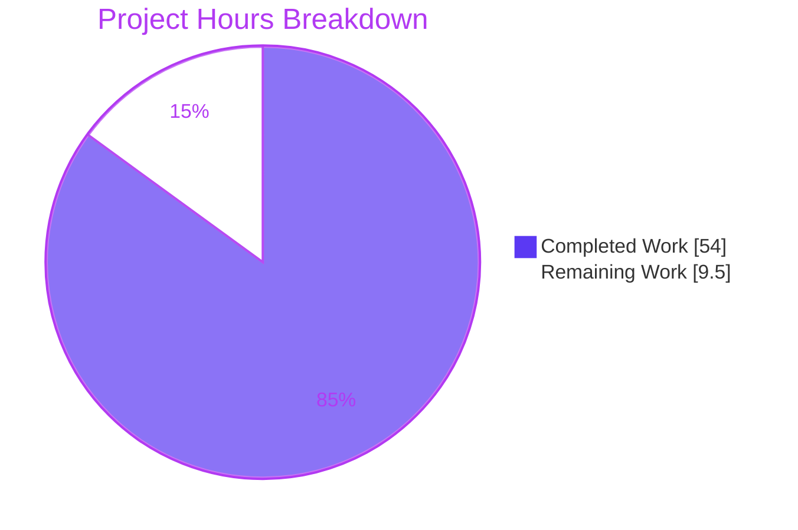
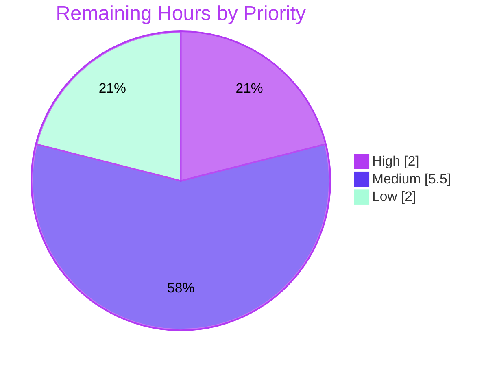

# 1. Executive Summary

## 1.1 Project Overview

This project adds an Express 5 HTTP service to a repository that previously held only a Java console program. `GET /` returns the plain-text body `Hello world`, and `GET /good-evening` returns `Good evening`. Express becomes the first declared dependency, so the change adds an npm manifest, a lock file pinning 68 packages, a Node.js runtime record, an ignore rule, a three-test contract suite, and matching updates to `README.md` and `blitzy/documentation/Project Guide.md`. A follow-up request reorganised `server.js` for readability — layout, inline comments and naming — with behaviour unchanged. `Hello.java` is unchanged. The scope is local tutorial use; deployment and CI are excluded.

## 1.2 Completion Status


| Metric | Value |
|---|---|
| Total Hours | 63.5 |
| Completed Hours (AI + Manual) | 54.0 (54.0 AI + 0.0 manual) |
| Remaining Hours | 9.5 |
| Percent Complete | **85.0%** |

54.0 ÷ (54.0 + 9.5) × 100 = **85.0% complete**. Every AAP deliverable and all seven readability items are done; the 9.5 remaining hours are review, test-hardening, documentation decisions and path-to-production work.

## 1.3 Key Accomplishments

- ✅ Express 5.2.1 pinned; `npm ci` installs 68 packages with 0 known vulnerabilities.
- ✅ `GET /` returns exactly `Hello world` (11 bytes) and `GET /good-evening` exactly `Good evening` (12 bytes), as `text/plain; charset=utf-8`.
- ✅ Unregistered paths, other methods and case or trailing-slash variants get Express's built-in 404.
- ✅ `npm start` honours `PORT` and exits 1 with one stderr line on an occupied or invalid port.
- ✅ `server.js` reads as eight commented sections with consistent names, and behaves byte-identically to the pre-refactor build.
- ✅ The contract suite passes 3 of 3 on Node.js 24.21.0 and 20.20.2.
- ✅ `Hello.java` is unchanged; `java Hello.java` still prints `Hello from Java!`.
- ✅ Both documents describe the 11-file tree, their service commands run as written, and the tree stays clean.

## 1.4 Critical Unresolved Issues

No release-blocking issue is open: **0 of the 9 requested items** (R1 Express, R2 `Good evening` endpoint, and readability items D1–D7 for `server.js`) remain open. **9 caveated items** need sign-off (see Section 5.2):

| Issue | Impact | Owner | ETA |
|---|---|---|---|
| 2 behaviours delivered beyond the AAP without committed tests: `PORT` validation and exact routing (`server.js`) | Correct at runtime but unguarded against regression; `server.js` lines 27–43 and 66–92 are uncovered | Reviewer / developer | 5.0 h |
| 1 runtime never exercised: the declared floor, Node.js 20.0.0 | Floor verified on 20.20.2 only, and Node.js 20 is end-of-life | Developer | 1.5 h |
| 1 operational caveat: SIGTERM to npm's pid alone leaves `node server.js` serving | Port stays bound until the node process is signalled | Operator | None — stop with Ctrl-C or the process group |
| 1 network-posture item: the service binds all interfaces and sends default Express headers | Exposure only if the host's network is reachable | Owner | 1.5 h, before any non-local deployment |
| 2 owner decisions deferred by the AAP: per-file GPL notices (F-006-RQ-005) and a `Hello.class` ignore rule (E-3) | Notice gap in three source files; untracked class after an in-place compile | Repository owner | 0.5 h |
| 2 documentation files outside the AAP's edit rules: `Technical Specifications.md` rewritten, and a second effort record in the development record | No runtime effect; a reader may take the pre-change specification or an older figure as current | Repository owner | 1.0 h |

## 1.5 Access Issues

No access issues identified. The npm registry needs no credentials, and nothing else external is required.

## 1.6 Recommended Next Steps

1. [High] Review the branch, including the `server.js` refactor; sign off or revert `PORT` validation and exact routing.
2. [Medium] Add child-process tests for the startup line, rejected `PORT`, bind failure and exact-routing 404s.
3. [Medium] Run the suite on Node.js 20.0.0, or raise `engines.node`.
4. [Medium] Keep or restore `blitzy/documentation/Technical Specifications.md`, and settle which effort record the development record carries.
5. [Low] Before non-local deployment, bind an explicit host and disable `X-Powered-By`; settle the GPL notice and `Hello.class` decisions.

# 2. Project Hours Breakdown

## 2.1 Completed Work Detail

| Component | Hours | Description |
|---|---|---|
| npm manifest — `package.json` (R1) | 1.0 | All nine AAP fields: `name`, `version`, `description`, `main`, `scripts.start`, `scripts.test`, `engines.node` `>=20.0.0`, `license` `GPL-3.0-only`, `dependencies.express` `^5.2.1` |
| Lock file — `package-lock.json` (R1) | 1.5 | Generated with npm 11.19.0: `lockfileVersion` 3, 69 entries, `express` 5.2.1 with its published integrity hash; licence census of all 68 packages (63 MIT, 4 ISC, 1 BSD-3-Clause) |
| Express service — `server.js` (R2 and the `Hello world` endpoint) | 6.0 | Two plain-text `GET` routes, exact routing, `PORT` resolution with a 3000 default, a guarded `app.listen`, the Express 5 listen-callback failure branch, the `{ app }` export, and inline design comments |
| Contract suite — `test/server.test.js` | 6.0 | Three tests on Node's built-in runner; a per-test `withServer` helper that binds port 0 and tears down deterministically on pass, failure or server error, compatible with the Node.js 20 floor (145 lines) |
| Runtime record and hygiene — `.nvmrc`, `engines.node`, `.gitignore` | 1.5 | Node.js 24.21.0 recorded for nvm, a `>=20.0.0` floor, and the single rule `node_modules/`; checked on 24.21.0 and 20.20.2 |
| `README.md` update | 5.0 | All eight sections kept in order; change summary within its 70-word, 8-line budget; prerequisites, run commands, output contract, 11-file layout and licence note; ASCII, LF-only, no line-number citations |
| `blitzy/documentation/Project Guide.md` update | 10.0 | Every present-tense claim the change falsifies corrected across 19 locations; historical Java results dated as of `2a78292`; §9 operator reference and Appendices B–F rewritten for the service; LF-only UTF-8 preserved |
| Java preservation and coexistence checks | 2.0 | `Hello.java` and `LICENSE` unchanged; strict compile, source and compiled launches, and simultaneous operation with the service |
| Service verification | 12.0 | HTTP contract, lifecycle and signals, `PORT` and console output, install reproducibility and drift refusal, load and memory, security probes, browser rendering, and replay of every command in both documents |
| `server.js` readability refactor (directive D1–D5) | 3.0 | Eight sections, each opened by a comment; every logical step commented, keeping the rationale for explicit `text/plain`, exact routing, each `PORT` check, the launch guard, the listen-callback failure branch and default shutdown; `value` → `rawPort` and `target` → `portSuffix`; ten simplification candidates assessed, none removable; whitespace normalised by hand (95 lines, ASCII, at most 79 columns) |
| Refactor equivalence verification (D6–D7) | 3.0 | Responses, headers, `PORT` matrix, console lines, exit codes, export, shutdown and browser rendering compared with the pre-refactor build on Node.js 24.21.0 and 20.20.2; only `GET /` and `GET /good-evening` answer |
| Development record updates for the refactor | 3.0 | `server.js` citations, line count and coverage in `blitzy/documentation/Project Guide.md` re-derived from the 95-line file; `PORT` wording, per-path 404 sizes and a job-control-safe background stop recipe documented; the as-of-`2a78292` validation, review, effort and glossary records kept as dated history |
| **Total** | **54.0** | Matches Completed Hours in Section 1.2 |

## 2.2 Remaining Work Detail

| Category | Hours | Priority |
|---|---|---|
| Review the branch, including the `server.js` refactor (`47da29e`, `de83859`); sign off or revert the two decisions beyond the AAP — `PORT` validation and exact routing (Section 5.2, D1–D2, D7) | 2.0 | High |
| Commit tests for delivered but untested behaviour: `resolvePort`, the rejected-`PORT` and bind-failure exits, the startup line, exact-routing 404 variants, the `withServer` error branches | 3.0 | Medium |
| Exercise the declared floor and reference runtimes exactly (Node.js 20.0.0; OpenJDK 25.0.4.1), or raise `engines.node` off end-of-life Node.js 20 (D3) | 1.5 | Medium |
| Settle the documentation files outside the AAP's edit rules: keep or restore `blitzy/documentation/Technical Specifications.md`, and choose the development record's current effort record (D8) | 1.0 | Medium |
| Pre-exposure hardening before any non-local deployment: explicit bind host, `X-Powered-By` disabled, `nosniff` on 200 responses | 1.5 | Low |
| Owner decisions deferred by the AAP: rights holder and year for per-file GPL notices (F-006-RQ-005); `Hello.class` ignore rule (E-3) (D6) | 0.5 | Low |
| **Total** | **9.5** | Matches Remaining Hours in Sections 1.2 and 7 |

## 2.3 Hours Reconciliation

| Check | Value |
|---|---|
| Section 2.1 completed | 54.0 h |
| Section 2.2 remaining | 9.5 h |
| Total (2.1 + 2.2) | 63.5 h = Total Hours in Section 1.2 |
| Completion | 54.0 ÷ 63.5 × 100 = 85.0% |

The readability request accounts for 9.0 completed hours (the last three rows of Section 2.1) and 1.5 remaining hours (0.5 of the review row and the 1.0 documentation decision). Confidence is high for the manifest, lock, runtime record, Java checks, review, documentation-decision and owner-decision rows, and medium for code, documentation and verification effort. The pre-exposure hardening estimate is low-confidence because it depends on the target environment. A CI executor is excluded from the hours: the AAP (§0.8.2) places CI workflows out of scope, so it appears only as a risk (Section 6).

# 3. Test Results

All results below were executed at HEAD `040017c` on 2026-10-07 and observed directly.

| Area / Category | Framework | Tests | Passed | Failed | Coverage | What This Proves |
|---|---|---|---|---|---|---|
| HTTP contract suite — Node.js 24.21.0 | Node built-in test runner (`npm test`) | 3 | 3 | 0 | `server.js`: 53.68% lines, 75.00% branches, 50.00% functions | Both bodies, the media type and the 404 for an unregistered path match the contract exactly |
| HTTP contract suite — Node.js 20.20.2 | Node built-in test runner | 3 | 3 | 0 | — | The suite runs unchanged on the Node.js 20 line the `engines` floor names |
| Refactor equivalence — current vs pre-refactor `server.js` | `node` listen stub, `curl`, `cmp` | 30 | 30 | 0 | 16 `PORT` values, 10 requests | The readability refactor changed no response, header, console line, exit code, export or stop behaviour |
| Service runtime probe (non-default port) | `curl`, `node` | 21 | 21 | 0 | n/a | Startup line, both endpoints, exact-routing 404s, `OPTIONS`, other methods, `PORT` rejection, bind failure, the `{ app }` export and the process-group stop behave as documented |
| Install reproducibility | `npm ci`, `npm ls` | 6 | 6 | 0 | 68 packages | The lock installs 68 packages online and offline, pins `express` 5.2.1 with its integrity hash, and a mismatched manifest is refused |
| Dependency security | `npm audit` | 1 | 1 | 0 | 68 packages | No known advisory affects the installed tree as of 2026-10-07 |
| Java program preservation | `javac -Xlint:all -Werror`, `java` | 3 | 3 | 0 | n/a | The strict compile is clean, and both launch forms print the 17-byte `Hello from Java!` greeting with empty stderr |
| Static checks, hygiene and runtime record | `node --check`, `git status`, nvm | 4 | 4 | 0 | n/a | Both JavaScript files parse, the tree is clean after install, run and test, and `.nvmrc` selects Node.js 24.21.0 with npm 11.19.0 |

The line figure counts the comment lines inside the two uncovered blocks; branch and function coverage reflect executable code only.

**Not Covered** — delivered, but not exercised by any committed test:

- **`resolvePort` and the rejected-`PORT` exit** (`resolvePort` at `server.js` lines 27–43; rejection call at line 88; shared failure branch at lines 73–80): verified only by runtime probes. Test valid, leading-zero, empty and invalid values before release.
- **The launch block** (`server.js` lines 65–92): the startup line, the EADDRINUSE message and exit code 1 have no committed test. Add a child-process test.
- **Exact routing** (`server.js` lines 18–19): removing either setting would not fail the suite. Add `/GOOD-EVENING` and `/good-evening/` 404 assertions.
- **Framework defaults** — `HEAD`, `OPTIONS`, 304 revalidation and the 431 for over-long requests: probed at runtime, not pinned by the suite.
- **`withServer` error branches** (`test/server.test.js`): the setup-failure, mid-test server-error and close-failure paths are not triggered by any committed test.
- **The declared floor, Node.js 20.0.0**: never executed; 20.20.2 was used. Run the suite on 20.0.0 or raise the floor.
- **The historical V1–V9 Java acceptance procedure**: kept outside the repository by design and not re-run; the Java contract is covered by the preservation checks above.

# 4. Runtime Validation & UI Verification

The service has no user interface; its human-facing surface is two plain-text bodies, verified with `curl` and in headless Chrome.

- ✅ **Start-up** — `npm start` prints `Hello service listening on http://localhost:<PORT>` and stays resident through idle periods and sustained traffic; launch to first 200 takes 73–145 ms.
- ✅ **Both endpoints** — `GET /` returns exactly 11 bytes `Hello world` and `GET /good-evening` exactly 12 bytes `Good evening`, both `text/plain; charset=utf-8`, with a stable `ETag` and 304 on revalidation; Chrome renders each as plain text with no console errors.
- ✅ **Unregistered paths** — Express's built-in HTML 404 with `Content-Security-Policy: default-src 'none'` and `nosniff`: 143 bytes for `/nope`, path-dependent elsewhere (151 for `/GOOD-EVENING`, 152 for `/good-evening/`); other methods and paths such as `/health` also return 404.
- ✅ **Configuration** — unset or empty `PORT` selects 3000; a decimal override is honoured with leading zeros dropped; invalid values and an occupied port each exit 1 with one stderr line; nothing else is logged per request.
- ✅ **Refactor equivalence** — responses, headers, `PORT` handling, console lines, exit codes and the `{ app }` export are byte-identical to the pre-refactor build on Node.js 24.21.0 and 20.20.2.
- ✅ **Load and resilience** — 0 errors across more than 31 million checked responses; p95 at 50 concurrent requests matches the pre-refactor build; descriptors and threads stay flat, and RSS grows about 1 MB per 1,500 requests in both builds.
- ✅ **Security probes** — XSS through the 404 page, path traversal, request smuggling, CRLF injection, CORS and source-disclosure probes produced no exploit; rejected `PORT` text is never echoed, and no stack trace or secret surfaced.
- ⚠ **Shutdown** — Ctrl-C, a process-group signal or SIGTERM to the node pid frees the port; SIGTERM to npm's pid alone leaves `node server.js` serving, and in-flight requests are cut rather than drained.
- ✅ **Java coexistence** — `java Hello.java` prints its greeting while the service runs, and no endpoint ever serves the Java greeting.
- ✅ **Integrations** — none at runtime and no authentication by design; the npm registry is reached only at install time.

**Never exercised at runtime:** deployment to any host beyond the local machine, TLS or a reverse proxy, and the Node.js 20.0.0 runtime.

# 5. Compliance & Quality Review

## 5.1 Compliance Matrix

| # | AAP Deliverable | Benchmark | Status | Progress | Evidence |
|---|---|---|---|---|---|
| 1 | npm manifest | All nine §0.4.2 fields; licence matches `LICENSE` | ✅ Pass | 100% | `package.json` |
| 2 | Lock file | Generated, not hand-written; 5.2.1 with integrity hash; `npm ci` reproducible, drift refused | ✅ Pass | 100% | `package-lock.json` |
| 3 | `GET /` → `Hello world`; `GET /good-evening` → `Good evening` | 200, `text/plain; charset=utf-8`, exact 11 and 12 bytes; no third endpoint | ✅ Pass | 100% | `server.js` routes; suite tests 1–3 |
| 4 | Listener and lifecycle | `require.main` guard, `{ app }` export, startup line, one failure branch, two console calls | ✅ Pass (⚠ launch block untested) | 100% | `server.js` lines 65–95 |
| 5 | `server.js` readability (directive D1–D7) | Commented sections; 2-space indentation, ASCII, LF; consistent names; no new route; behaviour byte-identical | ✅ Pass | 100% | `server.js`; refactor equivalence 30 of 30 |
| 6 | Runtime record | `engines.node` `>=20.0.0`; `.nvmrc` `24.21.0` | ✅ Pass (⚠ floor run on 20.20.2) | 100% | `package.json`, `.nvmrc` |
| 7 | Ignore rule | `node_modules/` only; tree clean after install and run | ✅ Pass | 100% | `.gitignore` |
| 8 | Contract suite | Three tests on built-ins, no added dependency, bare `node --test` | ✅ Pass | 100% | `test/server.test.js` |
| 9 | `README.md` | Eight sections in order; summary budget; ASCII, LF; runnable commands; 11-file layout | ✅ Pass | 100% | `README.md` |
| 10 | Development record | No stale absence claim; citations match the 95-line `server.js`; history dated as of `2a78292`; LF-only UTF-8 | ✅ Pass (⚠ two effort records, D8) | 100% | `blitzy/documentation/Project Guide.md` |
| 11 | Reference files | Zero edits to `Hello.java`, `LICENSE` and `Technical Specifications.md`; strict compile clean; 17-byte output | ⚠ Partial (`Technical Specifications.md` rewritten, D8) | 2 of 3 files | `Hello.java`, `LICENSE` |
| 12 | Code quality | No TODO, FIXME, stubs or hardcoded secrets; only `express` added; all licences GPLv3-compatible | ✅ Pass | 100% | Tracked tree at `040017c` |

## 5.2 AAP & Rule Divergences and Gaps

No user-specified rules were provided, so divergences are measured against the AAP and the owner's later readability request.

| # | What the AAP/Rule Required | What Was Delivered Instead | Why It Diverged | Impact | Remediation |
|---|---|---|---|---|---|
| D1 | `PORT` read as `process.env.PORT \|\| 3000` (§0.5.1) | `resolvePort` selects 3000 for unset or empty `PORT` and otherwise accepts only decimal 1–65535; anything else exits 1 (`server.js` lines 27–43, 65–92) | `app.listen` mishandles non-numeric, `0` and out-of-range values; the readability request then required the behaviour to stay | Safer, but untested; message says "bind" when none was attempted | Sign off and add tests, or revert |
| D2 | Two named routes; variants unspecified (§0.5.1, §0.8.2) | Case-sensitive and strict routing (`server.js` lines 18–19) | Keep variants from answering as a third endpoint | `/good-evening/` returns 404; no committed test guards it | Sign off and add tests, or remove |
| D3 | Floor on Node.js 20.0.0; Java on OpenJDK 25.0.4.1; service on port 3000 (§0.4.1, §0.6.1) | Node.js 20.20.2, OpenJDK 25.0.3; port 3000 only in isolated network namespaces or through a listen stub | Host prohibits older 20.x installs; 25.0.4.1 unavailable; port 3000 shared | Floor claim unproven on 20.0.0; Node.js 20 is end-of-life | Run on 20.0.0, or raise the floor |
| D4 | Manifest written without dependencies, then `npm install express@5.2.1` (§0.7.2) | Manifest committed complete in `e45e558`; lock generated against it in `87a8aaf` | The complete manifest was committed in the setup commit, before the lock existed | None: lock pins 5.2.1 with the AAP's integrity hash | None required |
| D5 | Stop with Ctrl-C or by killing the pid captured at launch (§0.6.1) | SIGTERM to npm's pid alone leaves `node server.js` serving | Consequence of the AAP-specified `scripts.start` and default signal handling | Port stays bound if only npm is signalled | None in code; use a documented stop path |
| D6 | AAP-sanctioned: per-file GPL notice (F-006-RQ-005) and `Hello.class` ignore rule (E-3) left open (§0.4.3, §0.7.2) | Neither added | No rights holder or year recorded; E-3 is an owner decision | Notice gap in three source files; untracked class after in-place compile | Owner supplies holder and year; decides the ignore rule |
| D7 | No refactoring or reformatting of an existing file beyond `README.md` (§0.8.2); `server.js` roughly 25 lines (§0.7.2) | `server.js` reorganised into commented sections with two internal renames; 95 lines (`47da29e`, `de83859`) | **Sanctioned** — the owner asked for better formatting, comments, naming and code, without changing functionality or adding endpoints | No behaviour change; line numbers shifted; line coverage counts the new comment lines | None; review the diff |
| D8 | `Technical Specifications.md` takes zero edits (§0.7.1, §0.8.2); development-record effort figures not recomputed (§0.5.2) | Specification rewritten in `bfd3b1d`; `Project Guide.md` leads with a 45.0/8.0/53.0 h, 84.9% record beside the original | Both files were regenerated by commits `bfd3b1d` and `ab26d15`; the reason for writing into AAP-protected content is not recorded | No runtime effect; the specification describes the pre-change repository, and one document carries two effort records | Keep, or restore the specification from `origin/jr_java1`; choose one current effort record |

**D1 — `PORT` validation.** The AAP reads the port as `process.env.PORT || 3000`. `server.js` instead resolves it through `resolvePort` (lines 27–43): unset or empty selects 3000, and otherwise only a decimal 1–65535 is accepted. A rejected value exits 1 with `Failed to bind port: PORT must be a decimal integer from 1 to 65535` (line 88, commit `a33214b`). The comments at lines 32–34 and 40–41 give the reason: `app.listen` binds an IPC socket path for non-numeric text, an unnamed port for `0`, and throws above 65535. The readability request forbade behaviour changes, so the validation stayed. It is untested, and its message says "bind" although nothing was bound. Accept it and add tests, or revert it.

**D2 — Exact routing.** The AAP names two paths but says nothing about letter case or trailing slashes, while §0.8.2 states that only `GET /` and `GET /good-evening` exist. Express's defaults would answer `/GOOD-EVENING` and `/good-evening/` with a greeting. `server.js` therefore enables `case sensitive routing` and `strict routing` before registering routes (lines 18–19, commit `0ece6c6`), so every variant falls through to the built-in 404, as `README.md` §Expected Output states. The trade-off is that a browser URL typed with a trailing slash returns 404, and no committed test guards either setting. The owner should decide whether the stricter contract stays, and if so add variant assertions to `test/server.test.js`.

**D3 — Verification runtimes.** The AAP exercises the floor on Node.js 20.0.0, runs the Java checks on OpenJDK 25.0.4.1 and starts the service on port 3000. On the verification host, installing any Node.js 20.x below 20.20.2 is prohibited, 25.0.3 is the only available OpenJDK 25 build, and port 3000 is shared. So the suite and service ran on 20.20.2, the Java checks on 25.0.3, and the default port was exercised only inside isolated network namespaces or through a listen stub. npm's engine check accepts 20.0.0, but the root-hook behaviour that shaped the test helper was never reproduced. Node.js 20 reached end-of-life on 2026-03-24, so run the suite on 20.0.0 in an isolated environment, or raise the floor.

**D4 — Lock generation order.** The AAP prescribes writing the manifest without a `dependencies` block and then running `npm install express@5.2.1`, so one command writes both the caret range and the pinned lock. Instead, `package.json` was committed complete, `express` `^5.2.1` included, in the setup commit `e45e558`, before any lock existed; the lock was then generated against it in `87a8aaf` with `npm install express@5.2.1`, which leaves that manifest unchanged under npm's default caret prefix. Running the prescribed sequence separately produced a byte-identical `package.json`. The AAP's concern, a resolution to a newer 5.x release, did not arise: the lock pins 5.2.1 with the AAP's integrity hash. No action is needed; regenerate the lock only with `npm install express@5.2.1`.

**D5 — Stop-path caveat.** The AAP's acceptance sequence says to stop the service with Ctrl-C or by killing the pid captured at launch. The AAP also sets `scripts.start` to `node server.js` and leaves shutdown to Node's defaults (§0.4.2, §0.5.2), so `npm start` runs as npm → `sh` → `node`. SIGTERM sent to npm's pid alone ends npm and leaves `node server.js` holding the port. Ctrl-C, a process-group signal and SIGTERM to the node pid all stop it cleanly, and `blitzy/documentation/Project Guide.md` §9.5 documents the caveat. No code change fits within the AAP; operators and scripts must use one of the documented stop paths.

**D6 — Owner decisions left open (AAP-sanctioned).** Two items stay open by the AAP's own decision. F-006-RQ-005 asks for the GPL's per-file copyright and warranty notice, which needs a named rights holder and year that no tracked file records. `server.js` and `test/server.test.js` therefore ship without one, as `Hello.java` already did, widening the gap from one source file to three. E-3 concerns the `Hello.class` that an in-place `javac Hello.java` leaves behind: `.gitignore` covers only `node_modules/`, and `README.md` §Build documents the `mktemp -d` alternative. Neither item affects behaviour. The owner must supply the holder and year, and decide whether class output should be ignored.

**D7 — Readability refactor of `server.js` (Sanctioned).** The AAP excludes refactoring or reformatting any existing file beyond `README.md` (§0.8.2) and plans `server.js` at roughly 25 lines (§0.7.2). The owner then asked for the file's indentation, inline comments, naming and unnecessary code to be improved, without changing functionality or adding endpoints. Commits `47da29e` and `de83859` deliver eight commented sections, rename `value` to `rawPort` and `target` to `portSuffix`, remove no code, and reach 95 lines. Stripped of comments and layout, the code is token-identical to the earlier build, and a side-by-side run returns identical responses, console lines and exit codes. Every other protected file has zero edits. Nothing needs closing beyond reviewing the 78-line diff.

**D8 — Documentation files outside the AAP's edit rules.** The AAP keeps `blitzy/documentation/Technical Specifications.md` at zero edits (§0.7.1, §0.8.2) and freezes the development record's effort figures at 32.0/6.0/38.0 h, 84.2% (§0.5.2). Commit `bfd3b1d` ("Adding Blitzy Technical Specifications") replaced the 8,321-line archived register with a 9,683-line specification of the repository before this change: five tracked files and no service. Commit `ab26d15` gave `blitzy/documentation/Project Guide.md` §1.2, §2 and §7 a 45.0/8.0/53.0 h, 84.9% record that predates the readability work; the frozen record sits beside it as dated history. Neither affects behaviour. The owner should keep or restore the specification (`git checkout origin/jr_java1 -- "blitzy/documentation/Technical Specifications.md"`) and choose one current effort record.

# 6. Risk Assessment

| Risk | Category | Severity | Probability | Mitigation | Status |
|---|---|---|---|---|---|
| Behaviour delivered without a committed test (`resolvePort`, launch block, exact routing, `withServer` error branches) regresses unnoticed; `server.js` line coverage is 53.68% | Technical | Medium | Medium | Add child-process and variant-route tests (Section 2.2) | Open |
| Declared floor `>=20.0.0` names an end-of-life runtime (Node.js 20, EOL 2026-03-24) that was never run at 20.0.0 | Technical / Integration | Medium | Medium | Run on 20.0.0 or raise the floor; deploy on the Node.js 24.21.0 recorded in `.nvmrc` | Open |
| The service binds all interfaces (`:::<PORT>`) while its startup line says `localhost`, so it is reachable from the host's network | Security | Medium | Medium | Pass an explicit host to `app.listen`, or firewall the port | Accepted (AAP default) |
| Default HTTP posture: `X-Powered-By: Express`; no `nosniff`, CSP or `X-Frame-Options` on 200 responses; `NODE_ENV` unset would render a stack trace if a future handler threw; no rate limit or connection cap, and a partial request is held about 74 s before a 408 | Security / Operational | Low | Low | `app.disable('x-powered-by')`, set headers in both handlers, run with `NODE_ENV=production`, front with a reverse proxy | Accepted (AAP default) |
| Stopping via npm's pid orphans `node server.js` on its port; SIGTERM cuts in-flight requests with no drain | Operational | Low | Medium | Stop with Ctrl-C, the process group or the node pid; use a process manager if deployed | Accepted, documented |
| No CI runs the suite, and nothing monitors the service: it logs only its startup line, Express 5's `app.listen` absorbs a single post-listening server error silently, and RSS grows about 1 MB per 1,500 requests | Operational | Medium | Medium | Add a CI job running the whole gate under a `timeout` wrapper (outside AAP scope); watch RSS if deployed long-running | Open |
| Supply chain: 68 transitive packages; a cold-cache install needs `registry.npmjs.org`; advisories change over time | Integration / Security | Low | Medium | Install only with `npm ci` from the lock; run `npm audit` periodically; mirror the registry for offline sites | Monitored |
| Documentation drift: `Technical Specifications.md` describes the pre-change five-file repository, and the development record carries two effort records that differ from this guide's figures | Operational | Low | Medium | Keep or restore the specification; keep one current effort record (Section 2.2) | Open |

# 7. Visual Project Status



Remaining work by priority (9.5 hours, from Section 2.2):



| Priority | Hours | Categories |
|---|---|---|
| High | 2.0 | Branch review, including the `server.js` refactor, and sign-off of D1–D2 |
| Medium | 5.5 | Tests for untested behaviour (3.0); floor and reference runtimes (1.5); documentation files outside the edit rules (1.0) |
| Low | 2.0 | Pre-exposure hardening (1.5); owner decisions (0.5) |
| **Total** | **9.5** | Equals Remaining Hours in Sections 1.2 and 2.2 |

# 8. Summary & Recommendations

The project is **85.0% complete** against the AAP-scoped work and the owner's readability request: 54.0 of 63.5 hours are delivered, and every requested item is in place and verified. Express 5.2.1 is declared and pinned, with 68 packages reproducibly installed from the committed lock. `server.js` answers `GET /` with `Hello world` and `GET /good-evening` with `Good evening`, byte-exact, as `text/plain; charset=utf-8`, and now reads as eight commented sections with consistent names. The runtime record, ignore rule, three-test suite and both documentation files match the 11-file tree, and `Hello.java` is untouched and still prints `Hello from Java!`.

Verification is broad. The suite passes 3 of 3 on Node.js 24.21.0 and 20.20.2, `npm audit` finds 0 vulnerabilities, and the strict Java compile is clean. A side-by-side comparison with the pre-refactor build matched on all 30 checks — `PORT` handling, responses, headers, console lines, exit codes, export and stop — and runtime probes confirm the contract, the bind-failure exit and the process-group stop. Under load the service returned no errors, it withstood XSS, traversal, smuggling and injection probes, and it rendered correctly in a browser.

The remaining 9.5 hours close four gaps: two behaviours beyond the AAP (`PORT` validation and exact routing) need sign-off and committed tests; the declared Node.js 20.0.0 floor, now an end-of-life line, has never been executed; two documentation files sit outside the AAP's edit rules; and two owner decisions deferred by the AAP are still open. The operational caveat, that signalling only npm's pid leaves the service bound, is documented and needs no code change.

The critical path to production is: review the branch, including the refactor, and sign off D1–D2 (2.0 h); add the missing tests (3.0 h); settle the floor (1.5 h); decide the specification and effort-record question (1.0 h). If the service will ever be reachable beyond the local machine, bind an explicit host and disable `X-Powered-By` first. A CI job running the whole gate under a timeout is recommended, although the AAP places CI outside this scope.

| Success Metric | Target | Observed |
|---|---|---|
| Endpoint bodies | `Hello world` / `Good evening`, exact | 11 / 12 bytes, exact |
| Suite | 3 passing, 0 failing | 3 / 3 on 24.21.0 and 20.20.2 |
| Refactor | No behaviour change | 30 of 30 checks identical |
| Install | 68 packages, no drift | 68; drift refused |
| Java contract | Unchanged | 17-byte greeting; strict compile clean |
| Tree hygiene | `git status --short` empty | Empty |

**Production readiness:** ready for the local tutorial use the AAP targets, and ready for merge once the branch review is complete. Complete the tests and the floor decision before calling it release-grade, and apply the hardening items before any network exposure.

# 9. Development Guide

Run every command from the repository root.

## 9.1 System Prerequisites

- **Node.js 24.21.0 with npm 11.19.0** — the target runtime, recorded in `.nvmrc`. The declared floor is `>=20.0.0` (`engines.node`).
- **A JDK** — any JDK compiles `Hello.java`; the source launch `java Hello.java` needs JDK 11 or later. Verified on OpenJDK 25.0.3.
- **git** and **curl**, on Linux or macOS with a POSIX shell.
- **Network access to `registry.npmjs.org`** for the first install on a machine with a cold npm cache. No credentials are needed.
- About 10 MB of disk for `node_modules/`.

## 9.2 Environment Setup

Optionally select the recorded Node.js version with nvm. nvm is a shell function, so load it first:

```bash
export NVM_DIR="${NVM_DIR:-$HOME/.nvm}"
[ -s "$NVM_DIR/nvm.sh" ] && . "$NVM_DIR/nvm.sh"
nvm install && nvm use
node -v && npm -v
```

Expected: `Now using node v24.21.0 (npm v11.19.0)`, then `v24.21.0` and `11.19.0`. For a system-wide nvm, set `NVM_DIR` to its directory before running the block.

The only variable the code reads is `PORT` (optional, default 3000). No `.env` file or secret is used; see Appendix E.

## 9.3 Dependency Installation

```bash
npm ci
npm ls express
ls node_modules | wc -l
```

Expected: `added 68 packages`, then `└── express@5.2.1`, then `65`. Always install with `npm ci`, which installs strictly from `package-lock.json` and refuses a mismatched manifest. With a warm cache, `npm ci --offline --no-audit --no-fund` installs the same 68 packages without network access.

## 9.4 Build and Static Checks

The service has no build step. Check syntax, and compile the Java program into a fresh directory so no `Hello.class` lands in the checkout:

```bash
node --check server.js && node --check test/server.test.js
B="$(mktemp -d)" && javac -Xlint:all -Werror -d "$B" Hello.java
```

Both commands exit 0 with no output.

## 9.5 Application Startup

Start the service, in the foreground:

```bash
npm start
```

Expected output:

```text
> hello@1.0.0 start
> node server.js

Hello service listening on http://localhost:3000
```

Override the port with `PORT=8080 npm start`. Unset or empty `PORT` selects 3000; any other value must be a decimal integer from 1 to 65535. Stop the service with Ctrl-C.

To run it in the background, keep the log outside the checkout and stop the whole process group, because SIGTERM to npm's pid alone leaves `node server.js` serving. The process-group id is recorded from inside the new session, so the recipe works with shell job control on or off:

```bash
L="$(mktemp -d)"
PORT=8080 setsid sh -c 'echo "$$" > "$1/pgid"; exec npm start' sh "$L" > "$L/start.log" 2>&1 &
sleep 2 && cat "$L/start.log"
kill -s TERM -- -"$(cat "$L/pgid")"
```

After the `kill`, `curl -s http://localhost:8080/` exits 7.

Run the Java program, independently of the service:

```bash
java Hello.java
java -cp "$B" Hello
```

Both print `Hello from Java!` and exit 0.

## 9.6 Verification Steps

With the service running on port 3000, check it from a second shell:

```bash
curl -s -o /dev/null -w '%{http_code} %{content_type}\n' http://localhost:3000/
curl -s http://localhost:3000/ | od -c | head -1
curl -s -o /dev/null -w '%{http_code} %{content_type}\n' http://localhost:3000/good-evening
curl -s http://localhost:3000/good-evening | od -c | head -1
curl -s -o /dev/null -w '%{http_code}\n' http://localhost:3000/nope
```

Expected, in order: `200 text/plain; charset=utf-8`; `0000000   H   e   l   l   o       w   o   r   l   d`; `200 text/plain; charset=utf-8`; `0000000   G   o   o   d       e   v   e   n   i   n   g`; `404`.

Run the suite, the floor check, coverage and the audit. The suite needs no running service:

```bash
CI=true npm test -- --test-reporter=tap
PATH="$NODE20_HOME/bin:$PATH" CI=true npm test -- --test-reporter=tap
node --test --experimental-test-coverage
npm audit
git status --short
```

Here `NODE20_HOME` is the directory of any Node.js 20 installation. Expected: `# tests 3`, `# pass 3` and `# fail 0` on each runtime; `server.js` at 53.68% lines, 75.00% branches and 50.00% functions, with lines 27–43 and 66–92 uncovered; `found 0 vulnerabilities`; and no output from `git status`.

## 9.7 Example Usage

```console
$ curl -s http://localhost:3000/; echo
Hello world
$ curl -s http://localhost:3000/good-evening; echo
Good evening
$ curl -s -o /dev/null -w '%{http_code}\n' http://localhost:3000/good-evening/
404
$ PORT=abc node server.js; echo "exit=$?"
Failed to bind port: PORT must be a decimal integer from 1 to 65535
exit=1
```

The bodies carry no trailing newline, hence the `echo`. Under `npm start` the same rejection line follows npm's two-line banner. The application also exports its Express instance for tests: `const { app } = require('./server.js')` binds nothing until `app.listen(0)` is called.

## 9.8 Troubleshooting

| Symptom | Cause | Resolution |
|---|---|---|
| `Failed to bind port 3000: listen EADDRINUSE: address already in use :::3000`, exit 1 | Another process holds the port | Stop it, or start on a free port, for example `PORT=8080 npm start` |
| `Failed to bind port: PORT must be a decimal integer from 1 to 65535`, exit 1 | `PORT` is text, `0`, signed, spaced or above 65535 | Set a plain decimal port, or unset `PORT` for 3000 |
| Port still answers after killing the launch pid | Only npm was signalled; `node server.js` kept running | Signal the recorded group with `kill -s TERM -- -"$(cat "$L/pgid")"` (Section 9.5), or signal the node pid |
| `Error: Cannot find module 'express'` | Dependencies not installed | Run `npm ci` |
| `npm ci` fails with `EUSAGE … are in sync` | `package.json` no longer matches the lock | Restore `package.json`, or run `npm install express@5.2.1` |
| `npm ci` fails with `EAI_AGAIN` or `ENOTCACHED` | Cold cache and no network | Allow access to `registry.npmjs.org` once, then use `--offline` |
| `node --test test/` fails with `MODULE_NOT_FOUND` | Directory form is not a test entry | Use `npm test` (bare `node --test`) |
| `/good-evening/` or `/GOOD-EVENING` returns 404 | Routing is case-sensitive and strict | Request `/good-evening` exactly |
| `?? Hello.class` in `git status` | `javac Hello.java` compiled in place | Delete it; compile with `-d "$(mktemp -d)"` |
| `nvm: command not found` | nvm not loaded in this shell | Run the 9.2 block, with `NVM_DIR` set for a system-wide install |

# 10. Appendices

## A. Command Reference

| Purpose | Command |
|---|---|
| Select Node.js from `.nvmrc` | `nvm install && nvm use` |
| Install dependencies from the lock | `npm ci` |
| Offline install from a warm cache | `npm ci --offline --no-audit --no-fund` |
| Confirm the Express version | `npm ls express` |
| Syntax check | `node --check server.js && node --check test/server.test.js` |
| Start the service | `npm start` or `PORT=8080 npm start` |
| Run the suite (TAP counters) | `CI=true npm test -- --test-reporter=tap` |
| Coverage | `node --test --experimental-test-coverage` |
| Dependency audit | `npm audit` |
| Strict Java compile | `B="$(mktemp -d)" && javac -Xlint:all -Werror -d "$B" Hello.java` |
| Run the Java program | `java Hello.java` or `java -cp "$B" Hello` |
| Check tree hygiene | `git status --short` |

## B. Port Reference

| Port | Used By | Notes |
|---|---|---|
| 3000 | Express service (default) | Bound on all interfaces when `PORT` is unset or empty |
| `PORT` (1–65535) | Express service | Decimal only; leading zeros dropped; an invalid non-empty value is rejected before binding, with exit 1 |
| 0 (OS-assigned) | Test suite | Each test binds an ephemeral port through `app.listen(0)` and closes it |
| None | Java program | Binds no port and makes no network call |

## C. Key File Locations

| Path | Role |
|---|---|
| `server.js` | Express application, 95 lines in eight commented sections: exact-routing settings, `resolvePort`, both routes, guarded `app.listen`, `{ app }` export |
| `test/server.test.js` | Contract suite and the `withServer` helper |
| `package.json` | Manifest: `express` `^5.2.1`, scripts, `engines.node`, licence |
| `package-lock.json` | Generated lock pinning 68 packages |
| `.nvmrc` / `.gitignore` | Node.js 24.21.0 record / `node_modules/` rule |
| `README.md` | User guide for both components |
| `blitzy/documentation/Project Guide.md` | Development record kept in the repository |
| `Hello.java` | Unchanged Java console program |
| `LICENSE` | GNU GPL v3 |
| `blitzy/documentation/Technical Specifications.md` | Specification of the repository before this change, rewritten in `bfd3b1d` (see D8) |

## D. Technology Versions

| Technology | Version | Notes |
|---|---|---|
| Node.js | 24.21.0 | Target runtime (`.nvmrc`) |
| Node.js floor | `>=20.0.0` | Declared in `engines.node`; exercised on 20.20.2 |
| npm | 11.19.0 | Bundled with Node.js 24.21.0; writes `lockfileVersion` 3 |
| Express | 5.2.1 | MIT; range `^5.2.1` |
| Installed packages | 68 | 63 MIT, 4 ISC, 1 BSD-3-Clause |
| Test runner | `node:test` | Built into Node.js; no added dependency |
| JDK | OpenJDK 25.0.3 | Version the Java checks ran on; no Java version is pinned |

## E. Environment Variable Reference

| Variable | Read By | Effect |
|---|---|---|
| `PORT` | `server.js`, only when run directly | Listening port; unset or empty selects 3000; otherwise must be decimal 1–65535 |
| `NODE_ENV` | Express | Unset in the documented launch; `production` suppresses stack traces in error pages |
| `DEBUG` | Express's `debug` dependency | Writes diagnostic lines, including request URLs, to stderr; leave unset |
| `NODE_DEBUG` | Node.js core | Writes core diagnostics (for example `http`) to stderr; leave unset |
| `CI` | npm | Set to `true` for non-interactive runs |

## F. Developer Tools Guide

- **Node test runner** — `npm test` runs every `test/*.test.js`; add `--test-reporter=tap` for stable counters, or run `node --test --experimental-test-coverage` for line, branch and function coverage.
- **npm** — `npm ci` for installs, `npm ls` to inspect the tree, `npm audit` for advisories. Regenerate the lock only with `npm install express@5.2.1`.
- **nvm** — optional; reads `.nvmrc`.
- **javac / java** — `-Xlint:all -Werror` is the strict gate for `Hello.java`.
- No linter, formatter, bundler or CI workflow is configured.

## G. Glossary

| Term | Meaning |
|---|---|
| AAP | The action plan that set the agreed scope of this change |
| Exact routing | Express's `case sensitive routing` and `strict routing` settings, both enabled in `server.js` |
| Final handler | Express's built-in responder for unmatched requests: a 404 HTML page |
| Floor | The lowest Node.js version the package declares support for (`engines.node`) |
| E-3 | Deferred hygiene item: `Hello.class` left untracked by an in-place compile |
| F-006-RQ-005 | Open licensing item: per-file GPL copyright and warranty notice |
| TAP | Test Anything Protocol, the output format whose counters are stable across Node.js versions |
